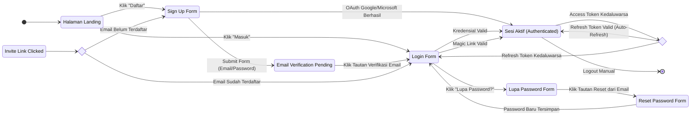
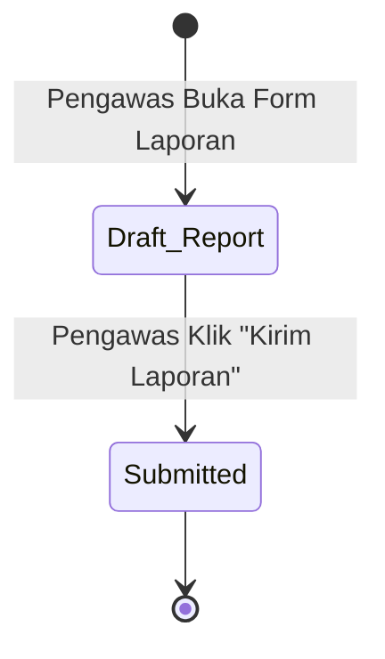
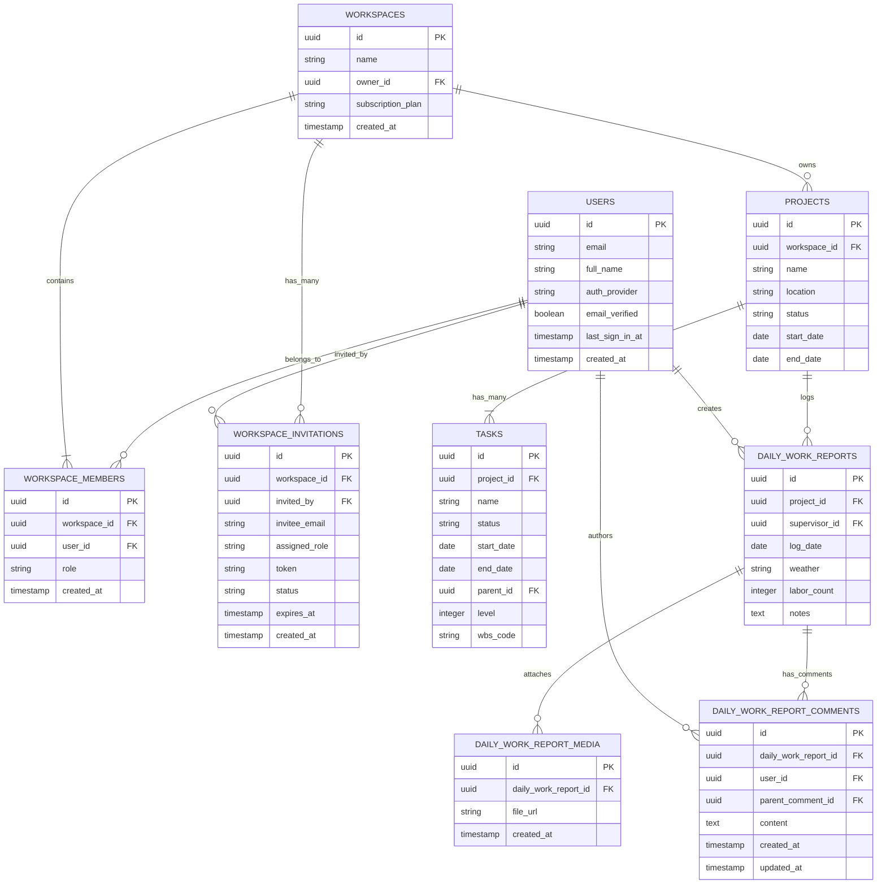

# Product Requirement Document (PRD): Constive Construction Management Platform

| Parameter Dokumen | Detail Informasi |
| --- | --- |
| Nama Sistem / Produk | Constive Construction Management Platform |
| Versi Dokumen | v0.3 |
| Status Dokumen | Approved |
| Penyusun (Author) | Tim Pengembang Constive |
| Tanggal Pembuatan | 22 Juli 2026 |
| Target Rilis MVP | Q4 2026 (Fase 1 Core MVP) |

## Riwayat Revisi Dokumen

| Versi | Tanggal | Penulis | Catatan Perubahan |
| --- | --- | --- | --- |
| v0.1 | 22 Juli 2026 | Tim Pengembang Constive | Draf awal berdasarkan konsolidasi rencana strategis, cetak biru teknis, dan penetapan model bisnis PLG Freemium. |
| v0.2 | 22 Juli 2026 | System Analyst | Penambahan modul [FT-004] Autentikasi & Pengelolaan Identitas Pengguna: alur Sign Up/Sign In, Reset Password/Magic Link, Invite Activation Gate, dan Manajemen Sesi JWT. Pembaruan ERD, NFR, dan Glosarium terkait. |
| v0.3 | 25 Juli 2026 | System Analyst | Hapus alur review status laporan harian & ganti dengan fitur komentar berdiskusi, rename daily_work_reports, Gantt Chart WBS multi-level. |

## Bab 1: Latar Belakang & Tujuan (Background & Objectives)

Industri konstruksi saat ini masih sangat bergantung pada proses manual, obrolan grup WhatsApp, dan berkas spreadsheet (Excel) untuk pelaporan serta koordinasi harian antara tim kantor dan tim lapangan. Metode konvensional ini memicu fragmentasi data, risiko hilangnya riwayat laporan harian, serta lambatnya pengambilan keputusan akibat tidak adanya visibilitas proyek secara real-time. Inefisiensi operasional ini berpotensi tinggi memicu keterlambatan penuntasan proyek dan pembengkakan anggaran biaya yang sering kali baru terdeteksi di akhir siklus pengerjaan.

Constive hadir sebagai platform B2B SaaS manajemen proyek konstruksi (*Construction Technology / ConTech*) *all-in-one* berbasis web yang kolaboratif dan *mobile-friendly* dengan mengadopsi model bisnis *Product-Led Growth* (PLG) gaya Jira (*Seat-Based Freemium & Multi-Workspace*). Platform ini memfasilitasi koordinasi erat antara tim kantor (Project Manager/Owner) dan tim lapangan (Pengawas/Mandor) dalam satu sistem terstruktur, mulai dari pengelolaan jadwal interaktif Gantt Chart hingga dokumentasi visual harian dari lokasi proyek. Proposisi nilai utamanya adalah mengeliminasi hambatan adopsi teknologi di lapangan dengan menggratiskan akses hingga 10 pengguna per *workspace* serta menyediakan fleksibilitas satu akun untuk banyak ruang kerja.

Visi jangka panjang Constive adalah menjadi standar utama platform kolaborasi dan ekosistem digital bagi seluruh pelaku industri konstruksi di Indonesia, mulai dari kontraktor rumahan hingga perusahaan skala *enterprise*. Dengan mendigitalisasi seluruh rantai operasional lapangan dan administrasi proyek, Constive menargetkan peningkatan efisiensi waktu koordinasi tim hingga 50% serta otomatisasi pemantauan progres secara real-time. Hal ini akan memangkas potensi keterlambatan proyek dan memberikan kepastian eksekusi kerja yang terukur bagi para pemangku kepentingan.

## Bab 2: Target Pengguna & Persona (Target Users & Personas)

| Role / Persona | Deskripsi Pengguna | Tujuan Utama (Goals) | Tingkat Literasi Digital |
| --- | --- | --- | --- |
| Super Admin / Workspace Admin | Pemilik bisnis, direksi kontraktor, atau tim IT/Ops yang mengelola identitas perusahaan dan tagihan workspace. | Mengontrol hak akses RBAC anggota tim, mengelola paket langganan, dan memantau seluruh workspace aktif. | Tinggi (Advanced) |
| Project Manager / Owner (Tim Kantor) | Tim perencana dan pengelola proyek di kantor yang menyusun lini masa, anggaran, serta pemantauan progres. | Memastikan proyek berjalan sesuai jadwal (on-schedule) dan anggaran melalui visualisasi Gantt Chart interaktif. | Sedang - Tinggi (Intermediate) |
| Pengawas / Mandor (Tim Lapangan) | Personel lapangan yang mengeksekusi dan memantau pekerjaan fisik di lokasi proyek setiap hari. | Melaporkan kondisi lapangan (cuaca, jumlah pekerja, kendala) dan mengunggah foto progres fisik secara cepat via antarmuka mobile-friendly. | Rendah - Sedang (Basic) |

## Bab 3: Matriks Hak Akses & Peran (Role-Based Access Control / RBAC)

| Modul / Fitur | Super Admin / Workspace Admin | Project Manager (PM) | Pengawas / Mandor (Supervisor) |
| --- | --- | --- | --- |
| Manajemen Workspace & Billing | C / R / U / D | R | - |
| Manajemen Anggota & Undangan | C / R / U / D | C / R / U | - |
| Manajemen Proyek & Task (Gantt Chart) | C / R / U / D | C / R / U / A | R |
| Laporan Harian, Foto Progres, & Komentar | C / R / U / D | C / R / U | C / R / U (Milik Sendiri) |

*Catatan: Semua anggota workspace dapat memberikan komentar pada laporan harian.*
| Manajemen Material & DMS (Fase 2) | C / R / U / D | C / R / U | R / C (Input Logistik) |
| RAB & Finansial (Fase 3) | C / R / U / D | C / R / U | - |

## Bab 4: Batasan Sistem (In-Scope vs Out-of-Scope)

### 4.1 In-Scope (Fitur Masuk MVP)

- **Manajemen Workspace & Multi-Tenancy (PLG Freemium):** Fitur ini memungkinkan pengguna membuat *workspace* mandiri atau bergabung ke beberapa *workspace* sekaligus dengan model lisensi paket Free (hingga 10 *users*) dan *Hybrid Seats*. Setiap akun pengguna bersifat independen dan dilengkapi antarmuka *Workspace Switcher* untuk memisahkan proyek pribadi dan kantor.
- **Interactive Gantt Chart & Real-Time Sync:** Modul penjadwalan visual yang memanfaatkan library gantt-task-react dengan *custom wrapper component*, TanStack Query untuk *Optimistic UI updates*, serta Supabase Realtime via WebSockets. Project Manager dapat mengelola hirarki WBS multi-level (diprioritaskan hingga level 2, contoh: "1. Fondasi -> 1.1 Pemasangan Tiang Pancang"), tanggal mulai/selesai, serta dependensi antar-tugas secara kolaboratif pada antarmuka desktop.
- **Form Laporan Harian Pintar & Dokumentasi Visual (Mobile-Friendly):** Antarmuka web yang dirancang *mobile-friendly* bagi Pengawas Lapangan untuk mencatat kondisi cuaca, jumlah tenaga kerja, catatan kendala, serta mengunggah foto progres fisik langsung dari lokasi proyek. Berkas foto diunggah langsung ke Supabase Storage via API untuk efisiensi penyimpanan database.

### 4.2 Out-of-Scope (Ditunda ke Fase Lanjutan)

- **Manajemen Material & Document Management System / DMS (Fase 2):** Fitur ini mencakup kontrol versi gambar kerja (CAD/PDF) serta pencatatan stok opname material gudang real-time yang ditunda hingga iterasi pasca-MVP. Modul ini nantinya juga dirancang untuk membuka peluang integrasi komisi B2B Marketplace pasokan material.
- **Kontrol Keuangan & HR / RAB & Cost vs Budget (Fase 3):** Penginputan Digital RAB dan dasbor komparasi real-time *Cost vs Budget* ditunda ke Fase 3 untuk memfokuskan rilis awal pada pelaporan operasional lapangan. Fitur ini nantinya akan menyertakan alarm batas anggaran dan *engine* ekspor data keuangan ke software akuntansi eksternal.

### 4.3 Negative Constraints (Aturan Khusus AI & Engineering)

**PENTING:** Aturan ini wajib dipatuhi oleh AI Coding Assistant saat menggenerasi kode dari spesifikasi ini!

- DILARANG mengubah arsitektur autentikasi *stateless* berbasis JWT dan Supabase Auth yang telah ditetapkan.
- DILARANG menyimpan berkas biner foto progres secara langsung di dalam database PostgreSQL (wajib menggunakan URL teks dari Supabase Storage).
- DILARANG melakukan *query* database tanpa menyertakan konteks workspace_id untuk menjaga isolasi data *multi-tenancy*.

## Bab 5: Detail Fitur & Spesifikasi Fungsional

### [FT-001] Manajemen Workspace & Undangan Anggota (Multi-Workspace)

- **Prioritas:** **Wajib**
- **User Story:** Sebagai Workspace Admin, saya ingin membuat ruang kerja perusahaan dan mengundang anggota tim via email/tautan agar seluruh tim dapat berkolaborasi sesuai hak aksesnya tanpa membatasi pekerja lapangan.

#### Deskripsi Fungsional

Fitur ini memfasilitasi pembuatan *workspace* perusahaan dengan skema bisnis *Freemium* (Gratis s.d. 10 *users*). Admin dapat mengundang anggota tim menggunakan email atau membagikan *Invite Link* / QR Code. Sistem menerapkan mekanisme *Hybrid Seats*, di mana penagihan lisensi berbayar hanya dihitung dari peran Admin/PM (*Paid Seats*), sedangkan peran Pengawas Lapangan diberikan akses gratis (*Free Contributor Seats*). Pengguna juga dapat membuat *workspace* pribadi terpisah menggunakan akun email yang sama.

#### Aturan Bisnis & Edge Cases (Business Logic)

- **Validasi Input & Batasan:** Nama *workspace* wajib diisi minimal 3 karakter. Sistem wajib memvalidasi batas jumlah *Paid Seats* aktif di dalam *workspace* sebelum menerima anggota baru dengan peran Admin/PM.
- **Kondisi Batas (Edge Case 1):** Jika kuota paket Free (10 *users*) atau kuota *Paid Seats* telah tercapai, sistem akan memblokir penambahan anggota baru dengan peran PM/Admin dan menampilkan dialog instruksi *Upgrade Plan*.
- **Penanganan Error (Error Handling):** Jika tautan undangan (*Invite Link*) telah kedaluwarsa atau dicabut oleh Admin, sistem wajib menolak proses aktivasi dan memberikan pesan kesalahan *"Tautan undangan sudah tidak berlaku"*.

#### Acceptance Criteria (Format Gherkin BDD)

```gherkin
Feature: Manajemen Workspace & Undangan Anggota

  Scenario: Success - Mengundang anggota tim baru ke workspace
    Given User telah login sebagai Workspace Admin dan berada di halaman "Team Settings"
    When User menginput email calon anggota "pengawas@constive.id" dan memilih role "SUPERVISOR"
    And User mengeklik tombol "Kirim Undangan"
    Then Sistem menyimpan entri undangan baru dan mengirimkan email tautan aktivasi
    And Dasbor menampilkan status anggota "Pending Activation"

  Scenario: Failure - Mencapai batas kuota user paket Free
    Given Workspace berada pada paket FREE dan telah memiliki 10 anggota aktif
    When Admin mencoba mengundang anggota ke-11 dengan role "PROJECT_MANAGER"
    Then Sistem menolak pengiriman undangan
    And Sistem menampilkan pesan dialog "Kuota pengguna paket Free telah tercapai. Silakan lakukan upgrade ke paket Standard."

```

### [FT-002] Interactive Gantt Chart & Kolaborasi Real-Time

- **Prioritas:** **Wajib**
- **User Story:** Sebagai Project Manager, saya ingin menyusun jadwal tugas interaktif secara visual dan melihat pembaruan progres secara otomatis agar koordinasi perencanaan berjalan akurat dan kolaboratif.

#### Deskripsi Fungsional

Modul penjadwalan visual interaktif berbasis desktop yang dibangun menggunakan library gantt-task-react dengan *custom wrapper component*. PM dapat melakukan aksi *drag-and-drop* untuk mengatur durasi, tanggal pelaksanaan, serta hirarki dependensi tugas (parent/sub-task) dengan dukungan WBS multi-level (hingga level 2). Sistem akan secara otomatis meng-generate kode WBS berdasarkan posisi dalam hirarki. Sistem memanfaatkan TanStack Query untuk *Optimistic UI updates* (UI berubah seketika secara lokal) dan Supabase Realtime via WebSockets untuk menyinkronkan perubahan ke layar PM lain secara instan tanpa memuat ulang halaman.

#### Aturan Bisnis & Edge Cases (Business Logic)

- **Validasi Input & Batasan:** Tanggal selesai tugas tidak boleh lebih awal dari tanggal mulai (*end_date >= start_date*). Dependensi tugas tidak boleh membentuk relasi melingkar (*circular dependency*).
- **Kondisi Batas (Edge Case 1):** Jika terjadi kegagalan jaringan saat PM menggeser batang Gantt Chart, *Optimistic UI* akan melakukan *rollback* tampilan ke kondisi semula dan mengembalikan posisi tugas ke koordinat awal.
- **Penanganan Error (Error Handling):** Jika dua PM mengedit tugas yang sama secara bersamaan, sistem memanfaatkan *Supabase Presence* untuk menampilkan indikator visual *"Sedang diedit oleh PM B"* dan menolak bentrokan *override* data.

#### Acceptance Criteria (Format Gherkin BDD)

```gherkin
Feature: Interactive Gantt Chart & Kolaborasi Real-Time

  Scenario: Success - Mengubah durasi tugas via drag-and-drop
    Given PM berada di halaman Gantt Chart proyek aktif
    When PM menggeser ujung batang tugas "Pengecoran Pondasi" dari tanggal 25 Juli ke 28 Juli
    Then Tampilan UI Gantt Chart langsung memperbarui durasi tugas secara lokal (Optimistic UI)
    And Sistem mengirim mutasi data ke API backend dan menyiarkan perubahan via Supabase Realtime ke PM lain
    And Database PostgreSQL mengonfirmasi pembaruan tanggal tugas

  Scenario: Success - Membuat sub-task di bawah parent task
    Given PM berada di halaman Gantt Chart
    When PM membuat tugas baru sebagai child dari tugas "1. Pekerjaan Tanah"
    Then Sistem menambahkan tugas tersebut dengan kode WBS otomatis "1.1" (level 2)
    And Tugas baru ditampilkan secara menjorok ke dalam di bawah parent task

  Scenario: Failure - Jaringan terputus saat menggeser tugas
    Given PM berada di halaman Gantt Chart dan koneksi internet terputus
    When PM menggeser batang tugas "Pemasangan Bekeristing"
    Then Sistem gagal mengirimkan request perubahan ke server
    And Tampilan Gantt Chart melakukan rollback otomatis ke tanggal awal sebelum digeser
    And Sistem menampilkan notifikasi toast "Gagal menyinkronkan perubahan. Periksa koneksi internet Anda."

```

### [FT-003] Form Laporan Harian Pintar & Dokumentasi Visual (Mobile-Friendly)

- **Prioritas:** **Wajib**
- **User Story:** Sebagai Pengawas Lapangan, saya ingin mengisi laporan harian dan mengunggah foto progres fisik dari ponsel di lokasi proyek agar tim kantor mendapatkan visibilitas operasional harian.

#### Deskripsi Fungsional

Formulir input terstruktur pada antarmuka web yang dioptimalkan secara *mobile-friendly* untuk diakses dari browser ponsel pintar. Pengawas Lapangan dapat memilih proyek aktif, menginput kondisi cuaca, jumlah tenaga kerja yang hadir, serta catatan kendala operasional. Pengawas dapat mengambil foto progres fisik menggunakan kamera ponsel dan mengunggahnya langsung ke Supabase Storage via API, di mana backend menyimpan URL foto ke tabel daily_work_report_media. Seluruh anggota workspace dapat memberikan komentar pada laporan harian yang telah dikirim, membalas komentar (threaded replies), serta mengedit atau menghapus komentar milik mereka sendiri.

#### Aturan Bisnis & Edge Cases (Business Logic)

- **Validasi Input & Batasan:** Input jumlah tenaga kerja wajib berupa angka non-negatif (>= 0). Format berkas foto yang diizinkan adalah JPG, JPEG, dan PNG dengan ukuran maksimal 5 MB per berkas.
- **Kondisi Batas (Edge Case 1):** Jika pengawasan dilakukan di area minim sinyal, form wajib mempertahankan data draf inputan teks lokal agar tidak hilang saat halaman browser tidak sengaja teroles (*refresh*).
- **Penanganan Error (Error Handling):** Jika pengunggahan foto gagal akibat berkas melebihi 5 MB, sistem wajib menolak berkas sebelum proses *upload* dimulai dan menampilkan peringatan *"Ukuran foto melebihi batas 5 MB"*.

#### Acceptance Criteria (Format Gherkin BDD)

```gherkin
Feature: Form Laporan Harian Pintar & Dokumentasi Visual

  Scenario: Success - Mengirim laporan harian beserta foto progres
    Given Pengawas Lapangan mengakses aplikasi via browser ponsel dan berada di halaman "Laporan Harian"
    When Pengawas mengisi log cuaca "Cerah", jumlah pekerja "12", catatan "Pengecoran kolom lantai 1 selesai", dan memilih 2 foto dari kamera
    And Pengawas mengeklik tombol "Kirim Laporan"
    Then Berkas foto terunggah ke Supabase Storage Bucket
    And Data laporan tersimpan di tabel `daily_work_reports` dan URL foto tersimpan di `daily_work_report_media`
    And Dasbor pemantauan tim kantor terbarui secara real-time

  Scenario: Success - Mengirim komentar pada laporan harian
    Given Anggota workspace berada di halaman detail laporan harian
    When Anggota mengisi teks komentar dan mengeklik "Kirim Komentar"
    Then Sistem menyimpan komentar tersebut dengan referensi ke laporan harian
    And Komentar ditampilkan dalam urutan waktu di bawah laporan harian

  Scenario: Failure - Mengunggah berkas foto melebihi batas ukuran
    Given Pengawas berada di formulir Laporan Harian
    When Pengawas memilih berkas gambar berukuran 8 MB dari galeri ponsel
    Then Sistem menolak berkas gambar tersebut pada sisi klien
    And Formulir menampilkan pesan kesalahan "File gambar terlalu besar (Maksimal 5 MB)"

```

### [FT-004] Autentikasi & Pengelolaan Identitas Pengguna (Authentication & User Identity Management)

- **Prioritas:** **Wajib**
- **User Story (Pendaftaran):** Sebagai calon pengguna baru, saya ingin mendaftarkan akun secara mandiri menggunakan email/password atau akun Google/Microsoft agar saya dapat langsung membuat workspace sendiri atau menerima undangan workspace orang lain.
- **User Story (Login):** Sebagai pengguna terdaftar, saya ingin masuk ke akun Constive saya dengan aman menggunakan kredensial email/password atau OAuth provider agar saya dapat mengakses seluruh workspace yang saya ikuti.
- **User Story (Pemulihan Akun):** Sebagai pengguna yang lupa kata sandi, saya ingin memulihkan akses akun saya melalui email Reset Password atau Magic Link agar saya tidak kehilangan akses ke data proyek saya.
- **User Story (Undangan Workspace):** Sebagai penerima undangan workspace, saya ingin mengeklik tautan undangan dan langsung diarahkan ke alur yang tepat (login jika sudah punya akun, atau sign up jika belum) agar proses bergabung ke tim berjalan mulus tanpa hambatan.
- **User Story (Manajemen Sesi):** Sebagai pengguna aktif, saya ingin sesi login saya tetap terjaga secara aman selama saya aktif menggunakan aplikasi, dan otomatis diperpanjang tanpa harus login ulang berulang kali, agar pengalaman kerja saya tidak terganggu.

#### Deskripsi Fungsional

Modul ini menjadi *gerbang utama* (entry gate) seluruh interaksi pengguna dengan platform Constive. Sistem autentikasi dibangun sepenuhnya di atas **Supabase Auth** dengan arsitektur *stateless* berbasis **JSON Web Token (JWT)** yang telah ditetapkan dalam batasan teknis proyek. Modul ini menangani empat alur kerja utama:

1. **Pendaftaran & Login Mandiri (Sign Up / Sign In):** Pengguna baru dapat mendaftar secara mandiri melalui formulir email/password atau menggunakan OAuth 2.0 (Google / Microsoft). Setelah pendaftaran via email, pengguna wajib memverifikasi alamat email melalui tautan konfirmasi yang dikirimkan oleh Supabase Auth. Login via OAuth melewatkan langkah verifikasi email karena identitas telah terverifikasi oleh provider. Setelah autentikasi berhasil, Supabase Auth menerbitkan sepasang token (Access Token JWT + Refresh Token).

2. **Pemulihan Akun (Reset Password / Magic Link):** Pengguna yang lupa kata sandi dapat meminta tautan *Reset Password* yang dikirimkan ke email terdaftar. Tautan ini memiliki masa berlaku terbatas (default 1 jam dari Supabase Auth) dan bersifat sekali pakai (*one-time use*). Alternatifnya, pengguna dapat memilih opsi *Magic Link* untuk login tanpa password — sistem mengirimkan tautan autentikasi sekali pakai ke email yang langsung membuat sesi baru saat diklik.

3. **Pintu Gerbang Undangan Workspace (Invite Activation Gate):** Saat Admin mengirim undangan workspace (dari [FT-001]), tautan undangan mengandung token unik dan metadata peran yang dituju. Ketika penerima undangan mengeklik tautan tersebut, sistem melakukan pengecekan status akun:
   - **Jika email sudah terdaftar di Constive:** Pengguna diarahkan ke halaman Login, dan setelah berhasil masuk, secara otomatis diproses menjadi anggota workspace dengan peran sesuai undangan.
   - **Jika email belum terdaftar:** Pengguna diarahkan ke halaman Sign Up dengan email terisi otomatis (*pre-filled*) dan tidak dapat diubah (*read-only*). Setelah pendaftaran dan verifikasi email berhasil, pengguna langsung tergabung ke workspace sesuai undangan.
   - Token undangan disimpan di *session storage* peramban selama proses autentikasi berlangsung agar konteks undangan tidak hilang.

4. **Manajemen Sesi & Auto-Refresh Token:** Sistem menerapkan skema *dual-token* dari Supabase Auth:
   - **Access Token (JWT):** Berumur pendek (default 1 jam), disimpan dalam memori aplikasi (*in-memory*) pada sisi klien, dikirimkan sebagai `Authorization: Bearer <token>` header pada setiap request API.
   - **Refresh Token:** Berumur panjang (default 7 hari, dapat dikonfigurasi), disimpan dalam **HTTP-Only Secure Cookie** dengan atribut `SameSite=Lax` untuk mencegah serangan CSRF dan XSS.
   - Mekanisme *auto-refresh*: Supabase Client SDK secara proaktif memperbarui Access Token sebelum kedaluwarsa menggunakan event listener `onAuthStateChange`. Jika Refresh Token juga kedaluwarsa (pengguna tidak aktif > 7 hari), sesi dihapus dan pengguna diarahkan ke halaman Login.

#### Aturan Bisnis & Edge Cases (Business Logic)

- **Validasi Input & Batasan (Sign Up):** Email wajib berformat valid (RFC 5322). Password minimal 8 karakter, mengandung kombinasi huruf besar, huruf kecil, dan angka. Nama lengkap wajib diisi minimal 2 karakter.
- **Keunikan Email:** Sistem wajib menolak pendaftaran jika alamat email telah terdaftar sebelumnya dan memberikan pesan generik *"Jika email ini terdaftar, Anda akan menerima instruksi selanjutnya"* (untuk mencegah *email enumeration attack*).
- **Kondisi Batas (Edge Case 1 — Undangan untuk Email yang Sudah Terdaftar):** Jika penerima undangan sudah memiliki akun Constive, sistem TIDAK boleh membuat akun duplikat. Sistem wajib mengarahkan ke alur Login, mengenali token undangan yang tersimpan di session, dan secara otomatis menambahkan pengguna ke workspace setelah login berhasil.
- **Kondisi Batas (Edge Case 2 — Double Submit pada Sign Up):** Jika pengguna mengeklik tombol "Daftar" berulang kali, sistem wajib menerapkan *rate limiting* pada endpoint dan menonaktifkan tombol submit setelah klik pertama untuk mencegah duplikasi request.
- **Kondisi Batas (Edge Case 3 — Token Undangan Kedaluwarsa saat Proses Sign Up):** Jika token undangan kedaluwarsa selama pengguna baru mengisi formulir Sign Up, pendaftaran akun tetap berhasil diproses, tetapi penggabungan ke workspace ditolak. Sistem menampilkan pesan *"Akun Anda berhasil dibuat, namun tautan undangan telah kedaluwarsa. Silakan minta undangan baru dari Admin workspace."*
- **Kondisi Batas (Edge Case 4 — Refresh Token Dicuri / Digunakan Ulang):** Supabase Auth menerapkan mekanisme *Refresh Token Rotation*. Jika Refresh Token yang telah di-rotasi digunakan kembali (indikasi pencurian), seluruh sesi aktif pengguna tersebut wajib langsung diinvalidasi (*revoke all sessions*) dan pengguna harus login ulang.
- **Penanganan Error (Error Handling):** Jika layanan Supabase Auth mengalami gangguan (*downtime*), halaman Login dan Sign Up wajib menampilkan pesan fallback *"Layanan autentikasi sedang tidak tersedia. Silakan coba beberapa saat lagi."* dan menyediakan tombol *Retry*.

#### Acceptance Criteria (Format Gherkin BDD)

```gherkin
Feature: Pendaftaran Akun Mandiri (Sign Up)

  Scenario: Success - Mendaftar akun baru via email/password
    Given Pengguna baru mengakses halaman "Sign Up" Constive
    When Pengguna mengisi nama lengkap "Ahmad Fauzi", email "ahmad@kontraktor.id", dan password yang memenuhi syarat
    And Pengguna mengeklik tombol "Daftar"
    Then Sistem membuat entri pengguna baru di Supabase Auth dengan status "email_not_verified"
    And Sistem mengirimkan email verifikasi ke "ahmad@kontraktor.id"
    And Halaman menampilkan pesan "Silakan periksa email Anda untuk verifikasi akun"

  Scenario: Success - Mendaftar akun baru via OAuth Google
    Given Pengguna baru mengakses halaman "Sign Up" Constive
    When Pengguna mengeklik tombol "Daftar dengan Google"
    And Pengguna menyelesaikan proses otorisasi di halaman Google OAuth
    Then Sistem membuat entri pengguna baru berdasarkan profil Google dengan status "email_verified"
    And Sistem menerbitkan Access Token JWT dan Refresh Token
    And Pengguna diarahkan ke halaman "Buat Workspace Baru" atau Dashboard

  Scenario: Failure - Mendaftar dengan email yang sudah terdaftar
    Given Pengguna mengakses halaman "Sign Up"
    When Pengguna mengisi email "sudah.terdaftar@email.com" yang sudah memiliki akun
    And Pengguna mengeklik tombol "Daftar"
    Then Sistem menampilkan pesan generik "Jika email ini terdaftar, Anda akan menerima instruksi selanjutnya"
    And Sistem TIDAK mengungkapkan apakah email tersebut sudah terdaftar atau belum

  Scenario: Failure - Mendaftar dengan password yang tidak memenuhi syarat
    Given Pengguna mengakses halaman "Sign Up"
    When Pengguna mengisi password "12345" yang kurang dari 8 karakter
    And Pengguna mengeklik tombol "Daftar"
    Then Sistem menolak pendaftaran pada sisi klien
    And Formulir menampilkan pesan validasi "Password minimal 8 karakter, mengandung huruf besar, huruf kecil, dan angka"

```

```gherkin
Feature: Login Pengguna (Sign In)

  Scenario: Success - Login via email/password
    Given Pengguna terdaftar mengakses halaman "Login" Constive
    When Pengguna mengisi email "ahmad@kontraktor.id" dan password yang benar
    And Pengguna mengeklik tombol "Masuk"
    Then Supabase Auth memvalidasi kredensial dan menerbitkan Access Token JWT serta Refresh Token
    And Access Token disimpan dalam memori aplikasi (in-memory)
    And Refresh Token disimpan dalam HTTP-Only Secure Cookie
    And Pengguna diarahkan ke halaman Dashboard / Workspace Switcher

  Scenario: Failure - Login dengan email yang belum diverifikasi
    Given Pengguna telah mendaftar via email tetapi belum mengeklik tautan verifikasi
    When Pengguna mencoba login dengan kredensial yang benar
    Then Sistem menolak login
    And Halaman menampilkan pesan "Email Anda belum diverifikasi. Silakan periksa kotak masuk email Anda."
    And Sistem menyediakan tombol "Kirim Ulang Email Verifikasi"

  Scenario: Failure - Login dengan password salah
    Given Pengguna terdaftar mengakses halaman "Login"
    When Pengguna mengisi email yang benar tetapi password yang salah
    And Pengguna mengeklik tombol "Masuk"
    Then Sistem menolak login dengan pesan generik "Email atau password salah"
    And Sistem TIDAK mengungkapkan apakah email terdaftar atau tidak

```

```gherkin
Feature: Pemulihan Akun (Reset Password & Magic Link)

  Scenario: Success - Meminta Reset Password via email
    Given Pengguna mengakses halaman "Lupa Password"
    When Pengguna mengisi email terdaftar "ahmad@kontraktor.id"
    And Pengguna mengeklik tombol "Kirim Tautan Reset"
    Then Sistem mengirimkan email berisi tautan Reset Password ke alamat email tersebut
    And Halaman menampilkan pesan "Jika email terdaftar, instruksi reset password telah dikirim."

  Scenario: Success - Mengatur ulang password via tautan Reset Password
    Given Pengguna mengeklik tautan Reset Password yang valid dari email
    When Pengguna mengisi password baru "SecurePwd123" dan konfirmasi password yang cocok
    And Pengguna mengeklik tombol "Simpan Password Baru"
    Then Supabase Auth memperbarui password pengguna
    And Seluruh sesi aktif sebelumnya diinvalidasi (force logout di perangkat lain)
    And Pengguna diarahkan ke halaman Login dengan pesan "Password berhasil diperbarui. Silakan login kembali."

  Scenario: Success - Login via Magic Link
    Given Pengguna mengakses halaman "Login" dan memilih opsi "Login via Magic Link"
    When Pengguna mengisi email terdaftar "ahmad@kontraktor.id"
    And Pengguna mengeklik tombol "Kirim Magic Link"
    Then Sistem mengirimkan email Magic Link sekali pakai ke alamat email tersebut
    And Pengguna yang mengeklik Magic Link dari email langsung mendapatkan sesi aktif tanpa memasukkan password

  Scenario: Failure - Tautan Reset Password kedaluwarsa
    Given Pengguna mengeklik tautan Reset Password yang telah melewati masa berlaku (> 1 jam)
    Then Sistem menolak tautan tersebut
    And Halaman menampilkan pesan "Tautan reset password telah kedaluwarsa. Silakan minta tautan baru."
    And Sistem menyediakan tombol "Minta Tautan Baru" yang mengarahkan ke halaman Lupa Password

```

```gherkin
Feature: Pintu Gerbang Undangan Workspace (Invite Activation Gate)

  Scenario: Success - Penerima undangan yang sudah punya akun Constive
    Given Admin workspace "PT Konstruksi Jaya" telah mengirim undangan ke email "budi@engineer.id"
    And Pengguna "budi@engineer.id" sudah memiliki akun terdaftar di Constive
    When Pengguna mengeklik tautan undangan dari email
    Then Sistem mendeteksi bahwa email sudah terdaftar
    And Sistem menyimpan token undangan di session storage peramban
    And Pengguna diarahkan ke halaman Login
    When Pengguna berhasil login
    Then Sistem membaca token undangan dari session storage
    And Sistem secara otomatis menambahkan pengguna ke workspace "PT Konstruksi Jaya" dengan role sesuai undangan
    And Pengguna diarahkan ke Dashboard workspace tersebut

  Scenario: Success - Penerima undangan yang belum punya akun Constive
    Given Admin workspace "PT Konstruksi Jaya" telah mengirim undangan ke email "citra@newuser.id"
    And Email "citra@newuser.id" belum terdaftar di Constive
    When Pengguna mengeklik tautan undangan dari email
    Then Sistem mendeteksi bahwa email belum terdaftar
    And Sistem menyimpan token undangan di session storage peramban
    And Pengguna diarahkan ke halaman Sign Up dengan field email terisi "citra@newuser.id" secara read-only
    When Pengguna mengisi nama lengkap, password, dan menyelesaikan pendaftaran
    And Pengguna memverifikasi email
    Then Sistem membaca token undangan dari session storage
    And Sistem secara otomatis menambahkan pengguna ke workspace "PT Konstruksi Jaya" dengan role sesuai undangan
    And Pengguna diarahkan ke Dashboard workspace tersebut

  Scenario: Failure - Token undangan kedaluwarsa saat proses Sign Up
    Given Penerima undangan yang belum punya akun sedang mengisi formulir Sign Up
    And Token undangan memiliki masa berlaku yang telah terlewati
    When Pengguna menyelesaikan pendaftaran dan verifikasi email
    Then Sistem berhasil membuat akun pengguna baru
    But Sistem menolak penggabungan ke workspace karena token undangan sudah kedaluwarsa
    And Halaman menampilkan pesan "Akun Anda berhasil dibuat, namun tautan undangan telah kedaluwarsa. Silakan minta undangan baru dari Admin workspace."

```

```gherkin
Feature: Manajemen Sesi & Auto-Refresh Token

  Scenario: Success - Auto-refresh Access Token sebelum kedaluwarsa
    Given Pengguna sedang aktif menggunakan aplikasi Constive
    And Access Token JWT akan kedaluwarsa dalam waktu kurang dari 60 detik
    When Event listener Supabase `onAuthStateChange` mendeteksi token mendekati kedaluwarsa
    Then Supabase Client SDK mengirimkan Refresh Token ke Supabase Auth endpoint
    And Supabase Auth menerbitkan Access Token baru dan Refresh Token baru (Token Rotation)
    And Sesi pengguna tetap aktif tanpa gangguan atau redirect ke halaman Login

  Scenario: Failure - Refresh Token kedaluwarsa (pengguna tidak aktif > 7 hari)
    Given Pengguna terakhir mengakses aplikasi lebih dari 7 hari yang lalu
    And Refresh Token telah melewati masa berlaku
    When Pengguna membuka kembali aplikasi Constive di peramban
    Then Supabase Client SDK gagal memperbarui Access Token
    And Sistem menghapus seluruh data sesi dari memori dan cookie
    And Pengguna diarahkan ke halaman Login dengan pesan "Sesi Anda telah berakhir. Silakan login kembali."

  Scenario: Security - Deteksi penggunaan ulang Refresh Token yang sudah di-rotasi
    Given Seorang aktor jahat telah mencuri Refresh Token pengguna "ahmad@kontraktor.id"
    And Refresh Token tersebut sudah di-rotasi (digantikan token baru oleh pengguna asli)
    When Aktor jahat mencoba menggunakan Refresh Token lama untuk mendapatkan Access Token baru
    Then Supabase Auth mendeteksi penggunaan ulang token yang sudah di-rotasi
    And Supabase Auth menginvalidasi SELURUH sesi aktif milik "ahmad@kontraktor.id" (revoke all sessions)
    And Pengguna asli harus melakukan login ulang pada semua perangkat

```

## Bab 6: Alur Kerja & Diagram State (Workflow & State Management)

### 6.1 Diagram Alur Autentikasi & Undangan Workspace (Mermaid Diagram)



### 6.2 Tabel Transisi Status Autentikasi

| Status Awal | Aksi / Trigger Event | Status Akhir | Aktor Penanggung Jawab | Syarat & Kondisi Validasi |
| --- | --- | --- | --- | --- |
| Landing | Klik "Daftar" atau "Masuk" | Sign Up Form / Login Form | Pengguna | - |
| Sign Up Form | Submit formulir pendaftaran (email/password) | Email Verification Pending | Pengguna Baru | Email valid, password memenuhi syarat (min 8 karakter, huruf besar, kecil, angka), nama lengkap terisi. |
| Sign Up Form | Klik "Daftar dengan Google/Microsoft" | Sesi Aktif (Authenticated) | Pengguna Baru | Otorisasi OAuth berhasil di sisi provider. |
| Email Verification Pending | Klik tautan verifikasi dari email | Login Form | Pengguna Baru | Tautan verifikasi masih berlaku dan belum pernah digunakan. |
| Login Form | Submit kredensial email/password | Sesi Aktif (Authenticated) | Pengguna Terdaftar | Email terverifikasi, password cocok, akun tidak terkunci. |
| Login Form | Klik Magic Link dari email | Sesi Aktif (Authenticated) | Pengguna Terdaftar | Magic Link masih berlaku dan belum pernah digunakan. |
| Login Form | Klik "Lupa Password?" | Lupa Password Form | Pengguna | - |
| Lupa Password Form | Klik tautan reset dari email | Reset Password Form | Pengguna | Tautan reset berlaku (< 1 jam) dan belum pernah digunakan. |
| Reset Password Form | Submit password baru | Login Form | Pengguna | Password baru memenuhi syarat validasi. Seluruh sesi lama diinvalidasi. |
| Invite Link Clicked | Sistem cek email penerima undangan | Login / Sign Up | Pengguna Penerima Undangan | Token undangan masih berlaku dan belum dicabut. Redirect sesuai status registrasi email. |
| Sesi Aktif | Access Token mendekati kedaluwarsa | Sesi Aktif (diperpanjang) | System / Supabase SDK | Refresh Token masih berlaku. Token Rotation diterapkan. |
| Sesi Aktif | Refresh Token kedaluwarsa | Login Form | System | Seluruh sesi dihapus. Pengguna wajib login ulang. |

### 6.3 Diagram Alur Status Laporan Harian (Mermaid Diagram)



### 6.4 Tabel Transisi Status Laporan Harian

| Status Awal | Aksi / Trigger Event | Status Akhir | Aktor Penanggung Jawab | Syarat & Kondisi Validasi |
| --- | --- | --- | --- | --- |
| Draft_Report | Klik "Kirim Laporan" | Submitted | Pengawas Lapangan | Log cuaca, jumlah pekerja wajib diisi, dan minimal 1 foto terlampir. |

## Bab 7: Gambaran Entitas & Model Data (High-Level Data Model)

### 7.1 Entity Relationship Diagram (High-Level ERD)



### 7.2 Daftar Entitas Utama

- **Entitas `users`:** Menyimpan informasi identitas tunggal pengguna internal (email, nama lengkap, metode autentikasi, status verifikasi email, dan catatan waktu login terakhir) yang digunakan untuk otentikasi lintas *workspace*. Tabel ini dikelola oleh Supabase Auth dengan kolom tambahan di tabel `profiles` untuk data bisnis.
- **Entitas `workspaces`:** Menyimpan data ruang kerja perusahaan/pribadi, pemilik *workspace*, serta status paket berlangganan B2B SaaS (*Free*, *Standard*, *Premium*, *Enterprise*).
- **Entitas `workspace_invitations`:** Menyimpan data undangan workspace yang dikirim oleh Admin, mencakup email penerima, peran yang ditetapkan, token unik sekali pakai, status undangan (*pending*, *accepted*, *expired*, *revoked*), dan masa berlaku token. Entitas ini menjadi kunci mekanisme *Invite Activation Gate* pada modul [FT-004].
- **Entitas `workspace_members`:** Tabel penghubung (*junction table*) antara users dan workspaces yang menentukan peran (*role*) spesifik pengguna di dalam *workspace* tersebut.
- **Entitas `projects`:** Menyimpan profil utama proyek konstruksi (nama, lokasi, status, tenggat waktu) yang terikat pada *workspace* tertentu.
- **Entitas `tasks`:** Menyimpan data hirarki struktur kerja (WBS) untuk rendering Gantt Chart, mencakup durasi, status, *parent_id* untuk dependensi tugas, *level* kedalaman hirarki, serta *wbs_code* yang dihasilkan otomatis.
- **Entitas `daily_work_reports`:** Menyimpan catatan rekapitulasi operasional harian yang dikirimkan oleh Pengawas Lapangan.
- **Entitas `daily_work_report_media`:** Menyimpan tautan URL gambar bukti progres lapangan yang terhubung dengan layanan cloud storage.
- **Entitas `daily_work_report_comments`:** Menyimpan data komentar pada laporan harian, referensi pembuat komentar (user_id), serta balasan berulir (parent_comment_id).

## Bab 8: Persyaratan Non-Fungsional (Non-Functional Requirements / NFR)

- **Keamanan Data & Otorisasi (Security):** Seluruh komunikasi data antara peramban dan server wajib menggunakan enkripsi SSL/TLS 1.3 (HTTPS). Otentikasi pengguna menerapkan *Stateless JWT* melalui Supabase Auth dengan otorisasi berbasis RBAC dan isolasi data multi-tenancy di tingkat *query* database. Access Token JWT disimpan secara *in-memory* (tidak di `localStorage`) untuk meminimalkan risiko XSS, sedangkan Refresh Token disimpan dalam **HTTP-Only Secure Cookie** dengan atribut `SameSite=Lax` untuk mitigasi CSRF. Sistem menerapkan *Refresh Token Rotation* dan *Reuse Detection* dari Supabase Auth untuk mendeteksi pencurian token.
- **Performa & Waktu Respon (Performance):** Waktu muat (*load time*) antarmuka laporan harian pada peramban seluler tidak boleh melebihi 2,0 detik pada jaringan seluler 4G. Perubahan visual pada Gantt Chart wajib menampilkan pembaruan seketika (*< 100 ms*) menggunakan *Optimistic UI*, dan sinkronisasi data antar-klien via Supabase Real-time wajib selesai dalam waktu kurang dari 500 milidetik.
- **Ketersediaan & Keandalan (Availability & Reliability):** Sistem menjamin tingkat ketersediaan (*uptime*) minimal 99,5% setiap bulan di luar jadwal pemeliharaan terencana. Seluruh data transaksi di database PostgreSQL dibackup secara otomatis setiap hari dengan retensi data selama 30 hari di cloud storage.
- **Pencatatan Audit Log (Audit Trail):** Sistem wajib mencatat setiap aktivitas mutasi data penting (pembuatan proyek, perubahan jadwal Gantt Chart, dan pengiriman laporan harian) ke dalam tabel audit terpisah. Log ini mencatat *timestamp*, *user_id*, *workspace_id*, aksi yang dilakukan, serta data sebelum-sesudah mutasi.

## Bab 9: Batasan Teknologi & Integrasi (Tech Constraints & Integrations)

### 9.1 Batasan Stack Teknologi Internal

- **Frontend Framework:** Next.js (React / TypeScript) dengan Tailwind CSS dan komponen shadcn/ui.
- **Gantt Chart Engine:** Library gantt-task-react dengan *Custom Abstraction Wrapper Component* dan State Management (TanStack Query / Zustand).
- **Backend Framework:** Node.js dengan NestJS (TypeScript) mengadopsi pola *Decoupled Architecture* dan *Modular Monolith*.
- **BaaS Provider (Full Supabase):** PostgreSQL (Database), Supabase Auth (Identity & OAuth), Supabase Storage (Object Storage), dan Supabase Real-time (WebSockets).
- **DevOps & Infrastruktur:** Containerization berbasis Docker dan otomasisasi CI/CD menggunakan GitHub Actions.

### 9.2 Tabel Integrasi Pihak Ketiga & Sistem Eksternal

| Nama Sistem / API | Tujuan Integrasi | Metode Integrasi | Potensi Kendala / Mitigasi |
| --- | --- | --- | --- |
| Supabase Auth | Autentikasi Stateless JWT dan OAuth (Google/Microsoft). | SDK / REST API | Token kedaluwarsa -> Implementasi mekanisme auto-refresh token di client. |
| Supabase Storage | Penyimpanan media foto progres harian & dokumen PDF. | AWS S3 API Compatible / SDK | Ukuran file besar -> Validasi client-side maksimal 5 MB dan kompresi gambar. |
| Supabase Real-time | Sinkronisasi data Gantt Chart dan notifikasi real-time. | WebSockets Protocol | Koneksi terputus -> Sediakan mekanisme auto-reconnect & indikator status koneksi. |
| Software Akuntansi Eksternal | Ekspor rekapitulasi data keuangan proyek (Fase 3). | REST API / File Export (CSV/Excel) | Perbedaan format data -> Buat data mapper engine pada modul pengekspor. |

## Bab 10: Metrik Keberhasilan & KPI (Success Metrics & KPIs)

| Metrik / KPI | Target Kuantitatif | Cara Pengukuran & Tools |
| --- | --- | --- |
| Efisiensi Pelaporan Lapangan | Memangkas waktu pengiriman laporan harian dari 2 jam (manual) menjadi < 10 menit. | Pengukuran timestamp pembuatan log harian pada database. |
| Tingkat Adopsi Pengguna (PLG) | > 70% pengguna Free Tier berhasil mengundang minimal 2 anggota tim dalam 14 hari pertama. | Google Analytics / PostHog event tracking pada alur undangan. |
| Kecepatan Sinkronisasi Gantt Chart | Latensi pembaruan jadwal antar-layar < 500 milidetik pada kondisi jaringan normal. | Monitoring performa WebSockets via Supabase Dashboard. |

## Bab 11: Asumsi & Batasan (Assumptions & Constraints)

- **Konektivitas Internet Lapangan:** Diasumsikan bahwa tim lapangan memiliki akses jaringan seluler dasar (minimal 3G/4G) yang memadai di lokasi proyek untuk mengirimkan laporan harian, mengacu pada fakta kebiasaan pelaporan rutin via WhatsApp.
- **Pengembangan Lintas Platform (API-First):** Pengembangan awal difokuskan sepenuhnya pada aplikasi web yang dirancang *mobile-friendly* untuk layar peramban ponsel. Pendekatan *API-First* diterapkan agar backend siap dihubungkan ke aplikasi *native* (iOS/Android) di masa depan tanpa membongkar ulang server.
- **Dukungan Peramban Pengguna:** Aplikasi web dirancang untuk berjalan optimal pada peramban modern (Google Chrome, Mozilla Firefox, Microsoft Edge, dan Safari versi 2 tahun terakhir). Dukungan untuk peramban tua (*legacy*) secara tegas tidak disediakan.

## Bab 12: Pertanyaan Terbuka & TBD (Open Questions / To Be Decided)

| ID | Pertanyaan / Isu yang Belum Jelas | Pihak Penanggung Jawab | Status / Tenggat Waktu |
| --- | --- | --- | --- |
| TQ-001 | Berapa nominal pasti harga langganan bulanan/tahunan per seat untuk paket Standard dan Premium? | Tim Business / Founder | Open / Sebelum Fase Beta |
| TQ-002 | Apakah perlu menerapkan fitur kompresi gambar otomatis di sisi peramban sebelum foto diunggah ke Supabase Storage? | Tech Lead / Frontend Engineer | Open / Sprint 2 |
| TQ-003 | Berapa lama masa berlaku token undangan workspace (default 7 hari)? Apakah Admin dapat mengkonfigurasi durasi ini? | Tech Lead / Product Manager | Open / Sprint 1 |
| TQ-004 | Apakah perlu menerapkan rate limiting pada endpoint login/signup untuk mitigasi brute-force attack (misal: maks 5 percobaan per menit per IP)? | Security Engineer / Tech Lead | Open / Sprint 1 |
| TQ-005 | Apakah fitur Magic Link akan diaktifkan sejak MVP atau ditunda ke iterasi selanjutnya sebagai opsi login alternatif? | Product Manager | Open / Sprint 1 |

## Bab 13: Glosarium

- **ConTech :** *Construction Technology*; istilah untuk inovasi perangkat lunak dan teknologi digital di industri konstruksi.
- **B2B SaaS :** *Business-to-Business Software as a Service*; model bisnis penyediaan perangkat lunak berbasis awan untuk klien perusahaan.
- **Product-Led Growth (PLG) :** Strategi pertumbuhan bisnis di mana produk itu sendiri menjadi pendorong utama akuisisi, konversi, dan retensi pengguna.
- **RBAC :** *Role-Based Access Control*; metode pembatasan hak akses sistem berdasarkan peran pengguna.
- **Gantt Chart :** Diagram batang horizontal untuk merencanakan dan melacak linimasa serta dependensi tugas proyek.
- **Modular Monolith :** Arsitektur perangkat lunak dengan satu repositori tunggal yang komponen kodenya dipisah secara ketat menurut domain bisnis.
- **BaaS :** *Backend-as-a-Service*; layanan komputasi awan yang menyediakan infrastruktur backend (database, auth, storage) siap pakai.
- **Optimistic UI Update :** Teknik pembaruan antarmuka di mana UI diubah seketika secara lokal sebelum server mengonfirmasi respons sukses.
- **JWT (JSON Web Token) :** Standar terbuka (RFC 7519) untuk merepresentasikan klaim keamanan antara dua pihak dalam format token terenkode yang bersifat *self-contained* dan *stateless*.
- **OAuth 2.0 :** Protokol otorisasi standar industri yang memungkinkan aplikasi pihak ketiga mengakses sumber daya pengguna tanpa mengekspos kredensial (password) pengguna.
- **Refresh Token Rotation :** Mekanisme keamanan di mana setiap kali Refresh Token digunakan untuk mendapatkan Access Token baru, Refresh Token lama diinvalidasi dan digantikan token baru; mendeteksi pencurian jika token lama digunakan ulang.
- **Magic Link :** Metode autentikasi *passwordless* di mana pengguna menerima tautan sekali pakai via email yang langsung membuat sesi aktif saat diklik, tanpa perlu memasukkan password.
- **HTTP-Only Cookie :** Atribut cookie yang mencegah akses dari JavaScript di sisi klien (via `document.cookie`), sehingga mengurangi risiko pencurian token melalui serangan *Cross-Site Scripting* (XSS).
- **Email Enumeration Attack :** Teknik serangan di mana penyerang mencoba menebak email terdaftar di suatu sistem berdasarkan perbedaan respons error pada halaman login/signup.