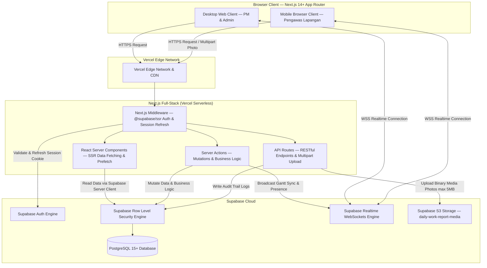
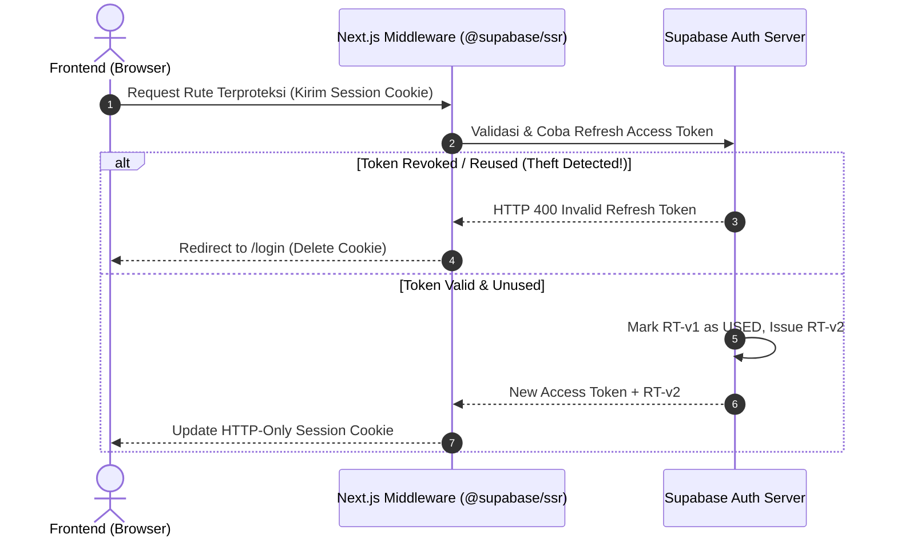
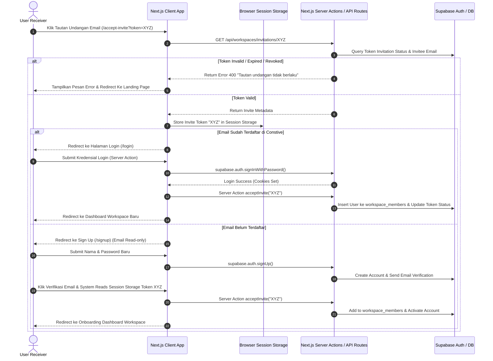

# Technical Design Document (TDD)
> **Project Name:** Constive Construction Management Platform  
> **Document Status:** Approved  
> **Last Updated:** 2026-07-31  
> **Author / Tech Lead:** Tim Pengembang Constive & Senior System Architect  

---

## 1. Metadata Dokumen & High-Level Tech Stack Overview

### 1.1 Parameter Proyek & Tech Stack Summary

| Kategori | Teknologi / Tool | Versi / Spesifikasi | Catatan & Rationale |
| :--- | :--- | :--- | :--- |
| **Dokumen** | Versioning | `v2.0.0` | Refaktor arsitektur ke Next.js full-stack, migrasi autentikasi ke `@supabase/ssr`, deployment ke Vercel + Supabase Cloud. |
| **Tech Lead** | Tim Pengembang Constive | `lead@constive.id` | Architect & Code Owner |
| **Target PRD** | Product Requirement Document: Constive | `v0.5` | Mengacu pada PRD Constive v0.5 (Approved) — adopsi Next.js full-stack, `@supabase/ssr`, Vercel. |
| **Full-Stack Framework** | Next.js App Router (TypeScript) | `v14.2+ / v15.x` | SSR, React Server Components, Server Actions, API Routes, Next.js Middleware — menangani seluruh lapisan frontend & backend logic. |
| **UI & Styling** | Tailwind CSS + shadcn/ui | `v3.4+` | Design Tokens, Utility-first CSS, Accessible Custom Components |
| **Gantt Chart Engine** | `gantt-task-react` (Custom Wrapper) | `v0.3+` | Custom Abstraction Wrapper untuk Interaktivitas & WBS |
| **Data Fetching & State** | TanStack Query + Zustand | `v5.x` (TanStack), `v4.x` (Zustand) | Server State + Optimistic UI + SSR Prefetching via `dehydrate`/`HydrationBoundary` (TanStack) & Global Client UI State (Zustand) |
| **Database Primary** | PostgreSQL via Supabase Cloud | `v15+` | Managed Relational Database, JSONB, Triggers, High Performance B-Tree/GIN Indexes |
| **BaaS / Auth / Realtime / Storage** | Supabase Cloud (`@supabase/ssr`) | `v2.x` | Supabase Auth via `@supabase/ssr` (cookie-based session management melalui Next.js Middleware), Supabase Realtime (WebSockets), Supabase Storage (S3-compatible) |
| **Deployment & Infrastruktur** | Vercel + Supabase Cloud | Serverless, Edge Network | Vercel (hosting, edge network, CI/CD otomatis via Git push, preview deployments) + Supabase Cloud (managed PostgreSQL, Auth, Storage, Realtime). Tidak menggunakan Docker. |

---

### 1.2 High-Level System Architecture Diagram



---

## 2. Arsitektur Kode & Directory Structure

### 2.1 Struktur Folder Proyek (Next.js Full-Stack App Router)

Proyek menggunakan **satu repositori tunggal** Next.js yang menangani seluruh lapisan frontend dan backend logic. Tidak ada direktori `backend/` terpisah — seluruh business logic dijalankan melalui **Server Actions**, **API Routes**, dan **React Server Components** di dalam Next.js App Router.

```text
constive/
├── .env.example                      # Environment Variables Template
├── .env.local                        # Local Development Env (gitignored)
├── next.config.mjs                   # Next.js Configuration
├── middleware.ts                     # @supabase/ssr — Auth Session Refresh & Route Protection
├── package.json
├── tsconfig.json
├── tailwind.config.ts
├── components.json                   # shadcn/ui Configuration
├── vercel.json                       # Vercel Deployment Configuration (optional overrides)
├── public/
│   ├── assets/
│   │   ├── logo.svg
│   │   └── icons/
│   └── favicon.ico
├── supabase/                         # Supabase CLI — Local Dev & Migration Scripts
│   ├── config.toml
│   ├── seed.sql
│   └── migrations/
│       ├── 00001_initial_schema.sql
│       └── 00002_rls_policies.sql
└── src/
    ├── app/                          # Next.js App Router — Pages, Layouts, API Routes
    │   ├── (auth)/                   # Route Group: Authentication & Onboarding (public)
    │   │   ├── login/
    │   │   │   └── page.tsx
    │   │   ├── signup/
    │   │   │   └── page.tsx
    │   │   ├── forgot-password/
    │   │   │   └── page.tsx
    │   │   ├── reset-password/
    │   │   │   └── page.tsx
    │   │   ├── accept-invite/
    │   │   │   └── page.tsx
    │   │   └── layout.tsx
    │   ├── (dashboard)/              # Route Group: Authenticated Workspace & Project Dashboard
    │   │   ├── workspace/
    │   │   │   └── [workspaceId]/
    │   │   │       ├── projects/
    │   │   │       │   ├── page.tsx
    │   │   │       │   └── [projectId]/
    │   │   │       │       ├── gantt/
    │   │   │       │       │   └── page.tsx
    │   │   │       │       ├── daily-work-reports/
    │   │   │       │       │   ├── page.tsx
    │   │   │       │       │   └── new/page.tsx
    │   │   │       │       └── page.tsx
    │   │   │       ├── settings/
    │   │   │       │   ├── members/page.tsx
    │   │   │       │   └── page.tsx
    │   │   │       └── page.tsx
    │   │   └── layout.tsx
    │   ├── auth/                     # Supabase Auth Callback Handler (non-grouped)
    │   │   └── callback/
    │   │       └── route.ts          # GET handler: exchange auth code → session cookie
    │   ├── api/                      # Next.js API Route Handlers (RESTful Endpoints)
    │   │   ├── health/route.ts
    │   │   ├── workspaces/
    │   │   │   ├── route.ts                                    # GET (list), POST (create)
    │   │   │   └── [wId]/
    │   │   │       ├── members/
    │   │   │       │   ├── route.ts                            # GET (list members)
    │   │   │       │   └── [uId]/route.ts                      # PATCH (update role), DELETE
    │   │   │       ├── invitations/
    │   │   │       │   ├── route.ts                            # POST (send invite)
    │   │   │       │   └── [token]/
    │   │   │       │       ├── route.ts                        # GET (validate invite token)
    │   │   │       │       └── accept/route.ts                 # POST (accept invite)
    │   │   │       └── projects/
    │   │   │           ├── route.ts                            # GET (list), POST (create)
    │   │   │           └── [pId]/
    │   │   │               ├── route.ts                        # GET (detail), PATCH, DELETE
    │   │   │               ├── tasks/
    │   │   │               │   ├── route.ts                    # GET (WBS list), POST (create)
    │   │   │               │   ├── batch-order/route.ts        # PATCH (reorder WBS batch)
    │   │   │               │   ├── dependencies/route.ts       # GET (all deps)
    │   │   │               │   └── [tId]/
    │   │   │               │       ├── route.ts                # PATCH (update), DELETE
    │   │   │               │       └── dependencies/
    │   │   │               │           ├── route.ts            # POST (add dependency)
    │   │   │               │           └── [depId]/route.ts    # DELETE (remove dependency)
    │   │   │               └── daily-work-reports/
    │   │   │                   ├── route.ts                    # GET (list), POST (submit + multipart)
    │   │   │                   └── [reportId]/
    │   │   │                       └── comments/
    │   │   │                           ├── route.ts            # GET (list), POST (create)
    │   │   │                           └── [commentId]/route.ts # PATCH (edit), DELETE
    │   │   └── audit-logs/
    │   │       └── route.ts                                    # GET (workspace audit trail)
    │   ├── layout.tsx                # Root Layout
    │   ├── page.tsx                  # Landing Page
    │   └── providers.tsx             # React Query, Theme, & Toast Providers
    ├── actions/                      # Server Actions — Mutations & Business Logic
    │   ├── auth.actions.ts           # signUp, signIn, signOut, resetPassword, magicLink
    │   ├── workspace.actions.ts      # createWorkspace, inviteMember, acceptInvite, updateMemberRole
    │   ├── project.actions.ts        # createProject, updateProject, deleteProject
    │   ├── gantt.actions.ts          # createTask, updateTaskGantt, deleteTask, batchReorderTasks
    │   ├── task-dependency.actions.ts # addDependency, removeDependency
    │   ├── daily-work-report.actions.ts # submitReport (multipart), createComment, editComment, deleteComment
    │   └── audit-log.actions.ts      # writeAuditLog (internal helper — called by other actions)
    ├── components/                   # UI Component Library
    │   ├── ui/                       # Primitive Design System Components (shadcn/ui)
    │   │   ├── button.tsx
    │   │   ├── dialog.tsx
    │   │   ├── input.tsx
    │   │   ├── select.tsx
    │   │   ├── badge.tsx
    │   │   ├── card.tsx
    │   │   └── toast.tsx
    │   ├── shared/                   # Shared Layout Components
    │   │   ├── header.tsx
    │   │   ├── sidebar.tsx
    │   │   ├── workspace-switcher.tsx
    │   │   └── user-nav.tsx
    │   └── features/                 # Domain-Specific Business Feature Components
    │       ├── auth/
    │       │   ├── login-form.tsx
    │       │   ├── signup-form.tsx
    │       │   └── invite-gate-card.tsx
    │       ├── workspace/
    │       │   ├── workspace-card.tsx
    │       │   ├── invite-member-modal.tsx
    │       │   └── member-list-table.tsx
    │       ├── gantt/                # Interactive Gantt Chart Feature
    │       │   ├── gantt-wrapper.tsx
    │       │   ├── gantt-toolbar.tsx
    │       │   ├── task-editor-dialog.tsx
    │       │   └── presence-avatars.tsx
    │       └── daily-work-report/    # Mobile-Friendly Daily Log & Photo Documentation
    │           ├── daily-work-report-form.tsx
    │           ├── photo-uploader.tsx
    │           ├── weather-selector.tsx
    │           └── log-card-list.tsx
    ├── hooks/                        # Custom React Hooks (Client Components)
    │   ├── use-auth.ts
    │   ├── use-workspace.ts
    │   ├── use-gantt-realtime.ts
    │   ├── use-optimistic-gantt.ts
    │   ├── use-daily-work-report-draft.ts
    │   └── use-debounce.ts
    ├── lib/                          # Core Libraries, Supabase Clients, & Utilities
    │   ├── supabase/                 # @supabase/ssr Client Factories (3 Environments)
    │   │   ├── client.ts             # createBrowserClient() — for Client Components
    │   │   ├── server.ts             # createServerClient() — for Server Components, Actions, API Routes
    │   │   └── middleware.ts          # createServerClient() — for Next.js Middleware (request/response cookies)
    │   ├── validations/              # Zod Validation Schemas (replaces NestJS class-validator DTOs)
    │   │   ├── workspace.schema.ts
    │   │   ├── project.schema.ts
    │   │   ├── task.schema.ts
    │   │   ├── daily-work-report.schema.ts
    │   │   └── comment.schema.ts
    │   ├── wrappers/                 # Decoupled Abstraction Wrappers (Adapter Pattern)
    │   │   ├── storage/
    │   │   │   ├── storage-service.interface.ts
    │   │   │   └── supabase-storage.wrapper.ts
    │   │   └── realtime/
    │   │       ├── realtime-service.interface.ts
    │   │       └── supabase-realtime.wrapper.ts
    │   ├── query-keys.ts             # TanStack Query Key Factory
    │   └── constants.ts              # Application-wide Constants
    ├── store/                        # Client Global State (Zustand)
    │   ├── use-ui-store.ts           # Sidebar, Modal, Theme States
    │   ├── use-workspace-store.ts    # Active Workspace Context
    │   └── use-gantt-presence-store.ts # Realtime Lock & Cursor States
    ├── types/                        # Shared TypeScript Types & Interfaces
    │   ├── index.ts
    │   └── domain/
    │       ├── user.type.ts
    │       ├── workspace.type.ts
    │       ├── project.type.ts
    │       ├── task.type.ts
    │       └── daily-work-report.type.ts
    └── utils/                        # Utility Helpers
        ├── formatters.ts
        └── validators.ts
```

> **Catatan Arsitektur:** Dengan adopsi Next.js full-stack, seluruh backend logic yang sebelumnya ditangani oleh NestJS kini diorganisasi sebagai berikut:
> - **`middleware.ts` (root):** Menjalankan `@supabase/ssr` session refresh pada setiap request, memproteksi route authenticated, dan menyediakan Supabase client ke seluruh lapisan aplikasi.
> - **`src/actions/`:** Server Actions menangani seluruh *write operations* (create, update, delete) dengan validasi Zod dan otorisasi workspace.
> - **`src/app/api/`:** API Route Handlers menyediakan RESTful endpoints untuk operasi yang membutuhkan *streaming response*, *multipart upload*, atau akses dari klien eksternal di masa depan.
> - **`src/lib/supabase/`:** Tiga factory function untuk membuat Supabase client sesuai konteks: `client.ts` (browser), `server.ts` (server-side), `middleware.ts` (middleware).
> - **`src/lib/validations/`:** Zod schemas menggantikan NestJS `class-validator` DTOs untuk validasi input yang type-safe dan isomorphic.

---

### 2.2 Organisasi Backend Logic dalam Next.js Full-Stack

Arsitektur ini mengeliminasi kebutuhan framework backend terpisah (NestJS). Seluruh *server-side business logic* diorganisasi dalam tiga lapisan Next.js:

| Lapisan | Lokasi | Tanggung Jawab | Contoh Penggunaan |
| :--- | :--- | :--- | :--- |
| **Middleware** | `middleware.ts` (root) | Auth session refresh (`@supabase/ssr`), route protection, request interception | Setiap HTTP request di-intercept untuk validasi & refresh cookie sesi. |
| **Server Actions** | `src/actions/*.actions.ts` | Mutasi data (create/update/delete), validasi Zod, otorisasi RBAC, audit logging | Form submission dari Client Components via `useFormAction` atau direct call. |
| **API Routes** | `src/app/api/**/*.route.ts` | RESTful endpoints, multipart file upload, webhook handlers, health checks | Multipart upload foto laporan harian, endpoint untuk integrasi klien eksternal. |
| **Server Components** | `src/app/**/*.page.tsx` | SSR data fetching, TanStack Query prefetching via `dehydrate`, initial page render | Halaman Gantt Chart memuat data tasks di server sebelum hydration ke client. |

> **Catatan Migrasi:** Seluruh modul NestJS (`auth.module`, `workspace.module`, `task.module`, `daily-work-report.module`, `audit-log.module`) telah dimigrasikan ke dalam `src/actions/` sebagai Server Actions dan `src/app/api/` sebagai API Route Handlers. NestJS guards (`JwtAuthGuard`, `WorkspaceIsolationGuard`) digantikan oleh Next.js Middleware dan helper function otorisasi di `src/lib/`.

---

### 2.3 Desain Komponen Abstraksi / Wrapper Design Pattern

Untuk mematuhi prinsip *Decoupled Architecture* dan *Negative Constraints* PRD, aplikasi dilarang melakukan *tight coupling* terhadap pustaka pihak ketiga. Komponen abstraksi di bawah ini dibuat menggunakan **Adapter Pattern** sebagai modul TypeScript murni (tanpa dependency injection framework).

#### 2.3.1 Interface Abstraksi Storage Service (`storage-service.interface.ts`)

```typescript
// src/lib/wrappers/storage/storage-service.interface.ts

export interface UploadFileOptions {
  bucket: string;
  path: string;
  fileBuffer: Buffer;
  contentType: string;
  maxSizeBytes?: number;
}

export interface UploadFileResult {
  fileKey: string;
  publicUrl: string;
  sizeBytes: number;
  mimeType: string;
}

export interface IStorageService {
  uploadFile(options: UploadFileOptions): Promise<UploadFileResult>;
  deleteFile(bucket: string, path: string): Promise<void>;
  getSignedUrl(bucket: string, path: string, expiresInSeconds: number): Promise<string>;
}
```

#### 2.3.2 Concrete Implementation Supabase Storage Wrapper (`supabase-storage.wrapper.ts`)

```typescript
// src/lib/wrappers/storage/supabase-storage.wrapper.ts

import { createClient, SupabaseClient } from '@supabase/supabase-js';
import { IStorageService, UploadFileOptions, UploadFileResult } from './storage-service.interface';

// Singleton Supabase Admin Client (Service Role — server-side only)
const supabaseAdmin: SupabaseClient = createClient(
  process.env.NEXT_PUBLIC_SUPABASE_URL!,
  process.env.SUPABASE_SERVICE_ROLE_KEY!
);

/**
 * Supabase Storage Wrapper — Pure TypeScript Module (no DI framework)
 * Used by Server Actions & API Routes for file storage operations.
 */
export const supabaseStorageWrapper: IStorageService = {
  async uploadFile(options: UploadFileOptions): Promise<UploadFileResult> {
    const { bucket, path, fileBuffer, contentType, maxSizeBytes = 5242880 } = options;

    // 1. Validate File Size (Default Max 5 MB per PRD FT-003)
    if (fileBuffer.byteLength > maxSizeBytes) {
      throw new Error(
        `File size (${(fileBuffer.byteLength / 1024 / 1024).toFixed(2)} MB) exceeds maximum allowed limit of ${maxSizeBytes / 1024 / 1024} MB`
      );
    }

    // 2. Validate Image MIME Types (per PRD FT-003: JPG, JPEG, PNG)
    const allowedMimeTypes = ['image/jpeg', 'image/png'];
    if (!allowedMimeTypes.includes(contentType.toLowerCase())) {
      throw new Error(
        `Invalid file type (${contentType}). Only JPG, JPEG, and PNG images are allowed.`
      );
    }

    // 3. Upload File to Supabase Storage Bucket
    const { data, error } = await supabaseAdmin.storage
      .from(bucket)
      .upload(path, fileBuffer, {
        contentType,
        upsert: true,
      });

    if (error) {
      throw new Error(`Failed to upload file to storage bucket: ${error.message}`);
    }

    // 4. Extract Public URL
    const { data: publicUrlData } = supabaseAdmin.storage
      .from(bucket)
      .getPublicUrl(data.path);

    return {
      fileKey: data.path,
      publicUrl: publicUrlData.publicUrl,
      sizeBytes: fileBuffer.byteLength,
      mimeType: contentType,
    };
  },

  async deleteFile(bucket: string, path: string): Promise<void> {
    const { error } = await supabaseAdmin.storage.from(bucket).remove([path]);
    if (error) {
      throw new Error(`Failed to delete file from storage: ${error.message}`);
    }
  },

  async getSignedUrl(bucket: string, path: string, expiresInSeconds: number = 3600): Promise<string> {
    const { data, error } = await supabaseAdmin.storage
      .from(bucket)
      .createSignedUrl(path, expiresInSeconds);

    if (error || !data) {
      throw new Error(`Failed to generate signed storage URL: ${error?.message}`);
    }

    return data.signedUrl;
  },
};
```

#### 2.3.3 Interface & Implementation Realtime Broadcast Service

```typescript
// src/lib/wrappers/realtime/realtime-service.interface.ts

export interface BroadcastEventPayload<T = any> {
  channel: string;
  event: string;
  payload: T;
}

export interface IRealtimeService {
  broadcastEvent<T>(eventData: BroadcastEventPayload<T>): Promise<void>;
}
```

```typescript
// src/lib/wrappers/realtime/supabase-realtime.wrapper.ts

import { createClient, SupabaseClient } from '@supabase/supabase-js';
import { IRealtimeService, BroadcastEventPayload } from './realtime-service.interface';

// Singleton Supabase Admin Client (Service Role — server-side only)
const supabaseAdmin: SupabaseClient = createClient(
  process.env.NEXT_PUBLIC_SUPABASE_URL!,
  process.env.SUPABASE_SERVICE_ROLE_KEY!
);

/**
 * Supabase Realtime Broadcast Wrapper — Pure TypeScript Module (no DI framework)
 * Used by Server Actions to broadcast events to connected clients via WebSockets.
 */
export const supabaseRealtimeWrapper: IRealtimeService = {
  async broadcastEvent<T>(eventData: BroadcastEventPayload<T>): Promise<void> {
    const channel = supabaseAdmin.channel(eventData.channel);

    await channel.send({
      type: 'broadcast',
      event: eventData.event,
      payload: eventData.payload,
    });

    // Unsubscribe after broadcast to prevent idle channel accumulation
    await supabaseAdmin.removeChannel(channel);
  },
};
```

---

## 3. Detailed Database Design & Security (PostgreSQL & Supabase)

### 3.1 Skema Database DDL SQL Lengkap

Skema di bawah ini telah disesuaikan sepenuhnya dengan entitas PRD Bab 7 (`users`, `workspaces`, `workspace_members`, `workspace_invitations`, `projects`, `tasks`, `daily_work_reports`, `daily_work_report_media`, `daily_work_report_comments`, dan `audit_logs`).

```sql
-- ==========================================
-- EXTENSIONS SETUP
-- ==========================================
CREATE EXTENSION IF NOT EXISTS "uuid-ossp";
CREATE EXTENSION IF NOT EXISTS "pgcrypto";

-- ==========================================
-- AUTOMATIC UPDATED_AT TRIGGER FUNCTION
-- ==========================================
CREATE OR REPLACE FUNCTION update_updated_at_column()
RETURNS TRIGGER AS $$
BEGIN
    NEW.updated_at = NOW();
    RETURN NEW;
END;
$$ LANGUAGE plpgsql;

-- ==========================================
-- TABLE 1: users (User Profiles & Identity)
-- Syncs with Supabase Auth auth.users
-- ==========================================
CREATE TABLE public.users (
    id UUID PRIMARY KEY DEFAULT gen_random_uuid(),
    email VARCHAR(255) NOT NULL UNIQUE,
    full_name VARCHAR(150) NOT NULL,
    auth_provider VARCHAR(50) NOT NULL DEFAULT 'email' CHECK (auth_provider IN ('email', 'google', 'microsoft')),
    email_verified BOOLEAN NOT NULL DEFAULT false,
    avatar_url TEXT,
    last_sign_in_at TIMESTAMP WITH TIME ZONE,
    created_at TIMESTAMP WITH TIME ZONE NOT NULL DEFAULT NOW(),
    updated_at TIMESTAMP WITH TIME ZONE NOT NULL DEFAULT NOW()
);

-- ==========================================
-- TABLE 2: workspaces (Tenant Root & Subscription)
-- ==========================================
CREATE TABLE public.workspaces (
    id UUID PRIMARY KEY DEFAULT gen_random_uuid(),
    name VARCHAR(100) NOT NULL,
    slug VARCHAR(100) NOT NULL UNIQUE,
    owner_id UUID NOT NULL REFERENCES public.users(id) ON DELETE RESTRICT,
    subscription_plan VARCHAR(50) NOT NULL DEFAULT 'FREE' CHECK (subscription_plan IN ('FREE', 'STANDARD', 'PREMIUM', 'ENTERPRISE')),
    is_active BOOLEAN NOT NULL DEFAULT true,
    max_free_seats INTEGER NOT NULL DEFAULT 10,
    metadata JSONB DEFAULT '{}'::jsonb,
    deleted_at TIMESTAMP WITH TIME ZONE DEFAULT NULL,
    created_at TIMESTAMP WITH TIME ZONE NOT NULL DEFAULT NOW(),
    updated_at TIMESTAMP WITH TIME ZONE NOT NULL DEFAULT NOW()
);

-- ==========================================
-- TABLE 3: workspace_members (RBAC Membership)
-- ==========================================
CREATE TABLE public.workspace_members (
    id UUID PRIMARY KEY DEFAULT gen_random_uuid(),
    workspace_id UUID NOT NULL REFERENCES public.workspaces(id) ON DELETE CASCADE,
    user_id UUID NOT NULL REFERENCES public.users(id) ON DELETE CASCADE,
    role VARCHAR(50) NOT NULL CHECK (role IN ('OWNER', 'ADMIN', 'PROJECT_MANAGER', 'SUPERVISOR')),
    created_at TIMESTAMP WITH TIME ZONE NOT NULL DEFAULT NOW(),
    updated_at TIMESTAMP WITH TIME ZONE NOT NULL DEFAULT NOW(),
    CONSTRAINT uq_workspace_user UNIQUE (workspace_id, user_id)
);

-- ==========================================
-- TABLE 4: workspace_invitations (Invite Activation Gate)
-- ==========================================
CREATE TABLE public.workspace_invitations (
    id UUID PRIMARY KEY DEFAULT gen_random_uuid(),
    workspace_id UUID NOT NULL REFERENCES public.workspaces(id) ON DELETE CASCADE,
    invited_by UUID NOT NULL REFERENCES public.users(id) ON DELETE RESTRICT,
    invitee_email VARCHAR(255) NOT NULL,
    assigned_role VARCHAR(50) NOT NULL CHECK (assigned_role IN ('ADMIN', 'PROJECT_MANAGER', 'SUPERVISOR')),
    token VARCHAR(255) NOT NULL UNIQUE,
    status VARCHAR(50) NOT NULL DEFAULT 'PENDING' CHECK (status IN ('PENDING', 'ACCEPTED', 'EXPIRED', 'REVOKED')),
    expires_at TIMESTAMP WITH TIME ZONE NOT NULL,
    created_at TIMESTAMP WITH TIME ZONE NOT NULL DEFAULT NOW(),
    updated_at TIMESTAMP WITH TIME ZONE NOT NULL DEFAULT NOW()
);

-- ==========================================
-- TABLE 5: projects (Construction Projects)
-- ==========================================
CREATE TABLE public.projects (
    id UUID PRIMARY KEY DEFAULT gen_random_uuid(),
    workspace_id UUID NOT NULL REFERENCES public.workspaces(id) ON DELETE CASCADE,
    name VARCHAR(150) NOT NULL,
    location VARCHAR(255),
    description TEXT,
    status VARCHAR(50) NOT NULL DEFAULT 'ACTIVE' CHECK (status IN ('DRAFT', 'ACTIVE', 'COMPLETED', 'ARCHIVED')),
    start_date DATE,
    end_date DATE,
    created_by UUID NOT NULL REFERENCES public.users(id) ON DELETE RESTRICT,
    deleted_at TIMESTAMP WITH TIME ZONE DEFAULT NULL,
    created_at TIMESTAMP WITH TIME ZONE NOT NULL DEFAULT NOW(),
    updated_at TIMESTAMP WITH TIME ZONE NOT NULL DEFAULT NOW()
);

-- ==========================================
-- TABLE 6: tasks (WBS Gantt Chart Engine)
-- ==========================================
CREATE TABLE public.tasks (
    id UUID PRIMARY KEY DEFAULT gen_random_uuid(),
    project_id UUID NOT NULL REFERENCES public.projects(id) ON DELETE CASCADE,
    workspace_id UUID NOT NULL REFERENCES public.workspaces(id) ON DELETE CASCADE,
    name VARCHAR(200) NOT NULL,
    description TEXT,
    status VARCHAR(50) NOT NULL DEFAULT 'TODO' CHECK (status IN ('TODO', 'IN_PROGRESS', 'COMPLETED')),
    start_date DATE NOT NULL,
    end_date DATE NOT NULL,
    duration_days INTEGER NOT NULL CHECK (duration_days >= 1),
    parent_id UUID REFERENCES public.tasks(id) ON DELETE CASCADE,
    order_index INTEGER NOT NULL DEFAULT 0,
    level INTEGER NOT NULL DEFAULT 0 CHECK (level >= 0),
    wbs_code VARCHAR(50),
    progress_percent INTEGER NOT NULL DEFAULT 0 CHECK (progress_percent BETWEEN 0 AND 100),
    created_by UUID NOT NULL REFERENCES public.users(id) ON DELETE RESTRICT,
    created_at TIMESTAMP WITH TIME ZONE NOT NULL DEFAULT NOW(),
    updated_at TIMESTAMP WITH TIME ZONE NOT NULL DEFAULT NOW(),
    CONSTRAINT chk_task_dates CHECK (end_date >= start_date)
);

-- ==========================================
-- TABLE 6b: task_dependencies (Gantt Chart Dependency Relations)
-- ==========================================
CREATE TABLE public.task_dependencies (
    id UUID PRIMARY KEY DEFAULT gen_random_uuid(),
    task_id UUID NOT NULL REFERENCES public.tasks(id) ON DELETE CASCADE,
    depends_on_task_id UUID NOT NULL REFERENCES public.tasks(id) ON DELETE CASCADE,
    dependency_type VARCHAR(10) NOT NULL DEFAULT 'FS' CHECK (dependency_type IN ('FS', 'SS', 'FF', 'SF')),
    workspace_id UUID NOT NULL REFERENCES public.workspaces(id) ON DELETE CASCADE,
    created_at TIMESTAMP WITH TIME ZONE NOT NULL DEFAULT NOW(),
    CONSTRAINT uq_task_dependency UNIQUE (task_id, depends_on_task_id),
    CONSTRAINT chk_no_self_dependency CHECK (task_id != depends_on_task_id)
);

-- ==========================================
-- TABLE 7: daily_work_reports (Field Operational Logs)
-- ==========================================
CREATE TABLE public.daily_work_reports (
    id UUID PRIMARY KEY DEFAULT gen_random_uuid(),
    project_id UUID NOT NULL REFERENCES public.projects(id) ON DELETE CASCADE,
    workspace_id UUID NOT NULL REFERENCES public.workspaces(id) ON DELETE CASCADE,
    supervisor_id UUID NOT NULL REFERENCES public.users(id) ON DELETE RESTRICT,
    log_date DATE NOT NULL DEFAULT CURRENT_DATE,
    weather VARCHAR(50) NOT NULL CHECK (weather IN ('CERAH', 'HUJAN', 'BERAWAN', 'GERIMIS')),
    labor_count INTEGER NOT NULL CHECK (labor_count >= 0),
    notes TEXT,
    deleted_at TIMESTAMP WITH TIME ZONE DEFAULT NULL,
    created_at TIMESTAMP WITH TIME ZONE NOT NULL DEFAULT NOW(),
    updated_at TIMESTAMP WITH TIME ZONE NOT NULL DEFAULT NOW(),
    CONSTRAINT uq_project_date_supervisor UNIQUE (project_id, log_date, supervisor_id)
);

-- ==========================================
-- TABLE 8: daily_work_report_media (Visual Photos Metadata)
-- ==========================================
CREATE TABLE public.daily_work_report_media (
    id UUID PRIMARY KEY DEFAULT gen_random_uuid(),
    daily_work_report_id UUID NOT NULL REFERENCES public.daily_work_reports(id) ON DELETE CASCADE,
    workspace_id UUID NOT NULL REFERENCES public.workspaces(id) ON DELETE CASCADE,
    file_url TEXT NOT NULL,
    file_name VARCHAR(255) NOT NULL,
    file_size_bytes INTEGER NOT NULL CHECK (file_size_bytes <= 5242880), -- Max 5 MB
    mime_type VARCHAR(50) NOT NULL CHECK (mime_type IN ('image/jpeg', 'image/png')),
    created_at TIMESTAMP WITH TIME ZONE NOT NULL DEFAULT NOW()
);

-- ==========================================
-- TABLE 9: daily_work_report_comments
-- ==========================================
CREATE TABLE public.daily_work_report_comments (
    id UUID PRIMARY KEY DEFAULT gen_random_uuid(),
    daily_work_report_id UUID NOT NULL REFERENCES public.daily_work_reports(id) ON DELETE CASCADE,
    workspace_id UUID NOT NULL REFERENCES public.workspaces(id) ON DELETE CASCADE,
    user_id UUID NOT NULL REFERENCES public.users(id) ON DELETE CASCADE,
    parent_comment_id UUID REFERENCES public.daily_work_report_comments(id) ON DELETE CASCADE,
    content TEXT NOT NULL,
    created_at TIMESTAMP WITH TIME ZONE NOT NULL DEFAULT NOW(),
    updated_at TIMESTAMP WITH TIME ZONE NOT NULL DEFAULT NOW()
);

-- ==========================================
-- FUNCTION & TRIGGER: Sync auth.users → public.users
-- ==========================================
CREATE OR REPLACE FUNCTION public.handle_new_user()
RETURNS TRIGGER AS $$
BEGIN
    INSERT INTO public.users (id, email, full_name, auth_provider, email_verified, avatar_url)
    VALUES (
        NEW.id,
        NEW.email,
        COALESCE(NEW.raw_user_meta_data->>'full_name', split_part(NEW.email, '@', 1)),
        COALESCE(NEW.raw_user_meta_data->>'provider', 'email'),
        COALESCE((NEW.raw_user_meta_data->>'email_verified')::boolean, false),
        NEW.raw_user_meta_data->>'avatar_url'
    );
    RETURN NEW;
END;
$$ LANGUAGE plpgsql SECURITY DEFINER;

CREATE TRIGGER on_auth_user_created
    AFTER INSERT ON auth.users
    FOR EACH ROW EXECUTE FUNCTION public.handle_new_user();

-- ==========================================
-- TABLE 10: audit_logs (Security Audit Trail)
-- ==========================================
CREATE TABLE public.audit_logs (
    id UUID PRIMARY KEY DEFAULT gen_random_uuid(),
    workspace_id UUID NOT NULL REFERENCES public.workspaces(id) ON DELETE CASCADE,
    user_id UUID REFERENCES public.users(id) ON DELETE SET NULL,
    action VARCHAR(100) NOT NULL,
    entity_type VARCHAR(50) NOT NULL,
    entity_id UUID NOT NULL,
    old_values JSONB,
    new_values JSONB,
    ip_address VARCHAR(45),
    created_at TIMESTAMP WITH TIME ZONE NOT NULL DEFAULT NOW()
);

-- ==========================================
-- INDEXES DEFINITION
-- ==========================================
CREATE INDEX idx_users_email ON public.users USING btree (email);
CREATE INDEX idx_workspaces_slug ON public.workspaces USING btree (slug);
CREATE INDEX idx_workspace_members_user ON public.workspace_members USING btree (user_id);
CREATE INDEX idx_workspace_members_ws ON public.workspace_members USING btree (workspace_id);
CREATE INDEX idx_workspace_invitations_token ON public.workspace_invitations USING btree (token);
CREATE INDEX idx_workspace_invitations_email ON public.workspace_invitations USING btree (invitee_email);

CREATE INDEX idx_projects_workspace ON public.projects USING btree (workspace_id);
CREATE INDEX idx_projects_status ON public.projects USING btree (status);

CREATE INDEX idx_tasks_project ON public.tasks USING btree (project_id);
CREATE INDEX idx_tasks_workspace ON public.tasks USING btree (workspace_id);
CREATE INDEX idx_tasks_parent ON public.tasks USING btree (parent_id);

CREATE INDEX idx_daily_work_reports_project ON public.daily_work_reports USING btree (project_id);
CREATE INDEX idx_daily_work_reports_workspace ON public.daily_work_reports USING btree (workspace_id);
CREATE INDEX idx_daily_work_reports_supervisor ON public.daily_work_reports USING btree (supervisor_id);
CREATE INDEX idx_daily_work_reports_date ON public.daily_work_reports USING btree (log_date);

CREATE INDEX idx_daily_work_report_media_report ON public.daily_work_report_media USING btree (daily_work_report_id);
CREATE INDEX idx_audit_logs_workspace ON public.audit_logs USING btree (workspace_id);
CREATE INDEX idx_audit_logs_created_at ON public.audit_logs USING btree (created_at);

CREATE INDEX idx_task_dependencies_task ON public.task_dependencies USING btree (task_id);
CREATE INDEX idx_task_dependencies_depends ON public.task_dependencies USING btree (depends_on_task_id);
CREATE INDEX idx_task_dependencies_workspace ON public.task_dependencies USING btree (workspace_id);

CREATE INDEX idx_workspaces_deleted ON public.workspaces USING btree (deleted_at) WHERE deleted_at IS NULL;
CREATE INDEX idx_projects_deleted ON public.projects USING btree (deleted_at) WHERE deleted_at IS NULL;
CREATE INDEX idx_daily_work_reports_deleted ON public.daily_work_reports USING btree (deleted_at) WHERE deleted_at IS NULL;

-- ==========================================
-- TRIGGERS SETUP FOR UPDATED_AT
-- ==========================================
CREATE TRIGGER trg_users_updated_at BEFORE UPDATE ON public.users FOR EACH ROW EXECUTE FUNCTION update_updated_at_column();
CREATE TRIGGER trg_workspaces_updated_at BEFORE UPDATE ON public.workspaces FOR EACH ROW EXECUTE FUNCTION update_updated_at_column();
CREATE TRIGGER trg_workspace_members_updated_at BEFORE UPDATE ON public.workspace_members FOR EACH ROW EXECUTE FUNCTION update_updated_at_column();
CREATE TRIGGER trg_workspace_invitations_updated_at BEFORE UPDATE ON public.workspace_invitations FOR EACH ROW EXECUTE FUNCTION update_updated_at_column();
CREATE TRIGGER trg_projects_updated_at BEFORE UPDATE ON public.projects FOR EACH ROW EXECUTE FUNCTION update_updated_at_column();
CREATE TRIGGER trg_tasks_updated_at BEFORE UPDATE ON public.tasks FOR EACH ROW EXECUTE FUNCTION update_updated_at_column();
CREATE TRIGGER trg_daily_work_reports_updated_at BEFORE UPDATE ON public.daily_work_reports FOR EACH ROW EXECUTE FUNCTION update_updated_at_column();
CREATE TRIGGER trg_daily_work_report_comments_updated_at BEFORE UPDATE ON public.daily_work_report_comments FOR EACH ROW EXECUTE FUNCTION update_updated_at_column();
```

---

### 3.2 Supabase Row Level Security (RLS) Policies

Setiap tabel di bawah ini dilindungi secara ketat oleh Supabase Row Level Security (RLS) untuk menjamin isolasi data multi-tenant berdasarkan `workspace_id`.

```sql
-- Enable RLS on all tables
ALTER TABLE public.users ENABLE ROW LEVEL SECURITY;
ALTER TABLE public.workspaces ENABLE ROW LEVEL SECURITY;
ALTER TABLE public.workspace_members ENABLE ROW LEVEL SECURITY;
ALTER TABLE public.workspace_invitations ENABLE ROW LEVEL SECURITY;
ALTER TABLE public.projects ENABLE ROW LEVEL SECURITY;
ALTER TABLE public.tasks ENABLE ROW LEVEL SECURITY;
ALTER TABLE public.daily_work_reports ENABLE ROW LEVEL SECURITY;
ALTER TABLE public.daily_work_report_media ENABLE ROW LEVEL SECURITY;
ALTER TABLE public.daily_work_report_comments ENABLE ROW LEVEL SECURITY;
ALTER TABLE public.audit_logs ENABLE ROW LEVEL SECURITY;

-- ==========================================
-- RLS POLICIES FOR: users
-- ==========================================
CREATE POLICY "Users can read own profile"
    ON public.users FOR SELECT
    USING (auth.uid() = id);

CREATE POLICY "Users can update own profile"
    ON public.users FOR UPDATE
    USING (auth.uid() = id);

-- ==========================================
-- RLS POLICIES FOR: workspaces
-- ==========================================
CREATE POLICY "Tenant Isolation: View Workspaces"
    ON public.workspaces FOR SELECT
    USING (
        EXISTS (
            SELECT 1 FROM public.workspace_members wm
            WHERE wm.workspace_id = public.workspaces.id
            AND wm.user_id = auth.uid()
        )
    );

CREATE POLICY "Tenant Isolation: Update Workspace"
    ON public.workspaces FOR UPDATE
    USING (
        EXISTS (
            SELECT 1 FROM public.workspace_members wm
            WHERE wm.workspace_id = public.workspaces.id
            AND wm.user_id = auth.uid()
            AND wm.role IN ('OWNER', 'ADMIN')
        )
    );

-- ==========================================
-- RLS POLICIES FOR: workspace_members
-- ==========================================
CREATE POLICY "Tenant Isolation: View Members"
    ON public.workspace_members FOR SELECT
    USING (
        workspace_id IN (
            SELECT wm.workspace_id FROM public.workspace_members wm
            WHERE wm.user_id = auth.uid()
        )
    );

CREATE POLICY "Tenant Isolation: Add Members"
    ON public.workspace_members FOR INSERT
    WITH CHECK (
        EXISTS (
            SELECT 1 FROM public.workspace_members wm
            WHERE wm.workspace_id = public.workspace_members.workspace_id
            AND wm.user_id = auth.uid()
            AND wm.role IN ('OWNER', 'ADMIN')
        )
    );

CREATE POLICY "Tenant Isolation: Update Members"
    ON public.workspace_members FOR UPDATE
    USING (
        EXISTS (
            SELECT 1 FROM public.workspace_members wm
            WHERE wm.workspace_id = public.workspace_members.workspace_id
            AND wm.user_id = auth.uid()
            AND wm.role IN ('OWNER', 'ADMIN')
        )
    );

CREATE POLICY "Tenant Isolation: Remove Members"
    ON public.workspace_members FOR DELETE
    USING (
        EXISTS (
            SELECT 1 FROM public.workspace_members wm
            WHERE wm.workspace_id = public.workspace_members.workspace_id
            AND wm.user_id = auth.uid()
            AND wm.role IN ('OWNER', 'ADMIN')
        )
    );

-- ==========================================
-- RLS POLICIES FOR: projects
-- ==========================================
CREATE POLICY "Tenant Isolation: View Projects"
    ON public.projects FOR SELECT
    USING (
        workspace_id IN (
            SELECT wm.workspace_id FROM public.workspace_members wm
            WHERE wm.user_id = auth.uid()
        )
    );

CREATE POLICY "Tenant Isolation: Create/Update Projects"
    ON public.projects FOR ALL
    USING (
        EXISTS (
            SELECT 1 FROM public.workspace_members wm
            WHERE wm.workspace_id = public.projects.workspace_id
            AND wm.user_id = auth.uid()
            AND wm.role IN ('OWNER', 'ADMIN', 'PROJECT_MANAGER')
        )
    );

-- ==========================================
-- RLS POLICIES FOR: tasks (Gantt Chart Engine)
-- ==========================================
CREATE POLICY "Tenant Isolation: View Tasks"
    ON public.tasks FOR SELECT
    USING (
        workspace_id IN (
            SELECT wm.workspace_id FROM public.workspace_members wm
            WHERE wm.user_id = auth.uid()
        )
    );

CREATE POLICY "Tenant Isolation: Manage Tasks"
    ON public.tasks FOR ALL
    USING (
        EXISTS (
            SELECT 1 FROM public.workspace_members wm
            WHERE wm.workspace_id = public.tasks.workspace_id
            AND wm.user_id = auth.uid()
            AND wm.role IN ('OWNER', 'ADMIN', 'PROJECT_MANAGER')
        )
    );

-- ==========================================
-- RLS POLICIES FOR: task_dependencies
-- ==========================================
ALTER TABLE public.task_dependencies ENABLE ROW LEVEL SECURITY;

CREATE POLICY "Tenant Isolation: View Task Dependencies"
    ON public.task_dependencies FOR SELECT
    USING (
        workspace_id IN (
            SELECT wm.workspace_id FROM public.workspace_members wm
            WHERE wm.user_id = auth.uid()
        )
    );

CREATE POLICY "Tenant Isolation: Manage Task Dependencies"
    ON public.task_dependencies FOR INSERT
    WITH CHECK (
        EXISTS (
            SELECT 1 FROM public.workspace_members wm
            WHERE wm.workspace_id = public.task_dependencies.workspace_id
            AND wm.user_id = auth.uid()
            AND wm.role IN ('OWNER', 'ADMIN', 'PROJECT_MANAGER')
        )
    );

CREATE POLICY "Tenant Isolation: Delete Task Dependencies"
    ON public.task_dependencies FOR DELETE
    USING (
        EXISTS (
            SELECT 1 FROM public.workspace_members wm
            WHERE wm.workspace_id = public.task_dependencies.workspace_id
            AND wm.user_id = auth.uid()
            AND wm.role IN ('OWNER', 'ADMIN', 'PROJECT_MANAGER')
        )
    );

-- ==========================================
-- RLS POLICIES FOR: daily_work_reports & daily_work_report_media
-- ==========================================
CREATE POLICY "Tenant Isolation: View Daily Logs"
    ON public.daily_work_reports FOR SELECT
    USING (
        workspace_id IN (
            SELECT wm.workspace_id FROM public.workspace_members wm
            WHERE wm.user_id = auth.uid()
        )
    );

CREATE POLICY "Tenant Isolation: Create/Update Daily Logs"
    ON public.daily_work_reports FOR ALL
    USING (
        EXISTS (
            SELECT 1 FROM public.workspace_members wm
            WHERE wm.workspace_id = public.daily_work_reports.workspace_id
            AND wm.user_id = auth.uid()
            AND wm.role IN ('OWNER', 'ADMIN', 'PROJECT_MANAGER', 'SUPERVISOR')
        )
    );

CREATE POLICY "Tenant Isolation: View Daily Log Media"
    ON public.daily_work_report_media FOR SELECT
    USING (
        workspace_id IN (
            SELECT wm.workspace_id FROM public.workspace_members wm
            WHERE wm.user_id = auth.uid()
        )
    );

CREATE POLICY "Tenant Isolation: Manage Daily Log Media"
    ON public.daily_work_report_media FOR ALL
    USING (
        EXISTS (
            SELECT 1 FROM public.workspace_members wm
            WHERE wm.workspace_id = public.daily_work_report_media.workspace_id
            AND wm.user_id = auth.uid()
            AND wm.role IN ('OWNER', 'ADMIN', 'PROJECT_MANAGER', 'SUPERVISOR')
        )
    );

-- ==========================================
-- ==========================================
-- RLS POLICIES FOR: daily_work_report_comments
-- ==========================================
CREATE POLICY "Tenant Isolation: View Comments"
    ON public.daily_work_report_comments FOR SELECT
    USING (
        workspace_id IN (
            SELECT wm.workspace_id FROM public.workspace_members wm
            WHERE wm.user_id = auth.uid()
        )
    );

CREATE POLICY "Tenant Isolation: Create Comments"
    ON public.daily_work_report_comments FOR INSERT
    WITH CHECK (
        workspace_id IN (
            SELECT wm.workspace_id FROM public.workspace_members wm
            WHERE wm.user_id = auth.uid()
        )
        AND auth.uid() = user_id
    );

CREATE POLICY "Tenant Isolation: Update Comments"
    ON public.daily_work_report_comments FOR UPDATE
    USING (auth.uid() = user_id);

CREATE POLICY "Tenant Isolation: Delete Comments"
    ON public.daily_work_report_comments FOR DELETE
    USING (auth.uid() = user_id);

CREATE POLICY "Admin Moderation: Delete Any Comment"
    ON public.daily_work_report_comments FOR DELETE
    USING (
        EXISTS (
            SELECT 1 FROM public.workspace_members wm
            WHERE wm.workspace_id = public.daily_work_report_comments.workspace_id
            AND wm.user_id = auth.uid()
            AND wm.role IN ('OWNER', 'ADMIN')
        )
    );

-- ==========================================
-- RLS POLICIES FOR: audit_logs
-- ==========================================
CREATE POLICY "Tenant Isolation: View Audit Logs"
    ON public.audit_logs FOR SELECT
    USING (
        EXISTS (
            SELECT 1 FROM public.workspace_members wm
            WHERE wm.workspace_id = public.audit_logs.workspace_id
            AND wm.user_id = auth.uid()
            AND wm.role IN ('OWNER', 'ADMIN')
        )
    );

---

## 4. API Specifications & Error Contracts (RESTful APIs)

### 4.1 Tabel Pemetaan API Endpoints & Server Actions

> **Catatan Autentikasi:** Endpoints autentikasi kustom (login, register, refresh) telah dihapus karena otentikasi dikelola langsung melalui `@supabase/ssr` flows di **Server Actions** dan divalidasi oleh **Next.js Middleware**.

| HTTP Method / Action | API Path / Action Name | Deskripsi Fungsi | Auth Required | Middleware / RBAC Helpers |
| :--- | :--- | :--- | :---: | :--- |
| `GET` | `/api/workspaces` | Get list workspace milik user aktif | ✅ Yes | Next.js Middleware |
| `POST` | `createWorkspace` (Action) | Buat workspace perusahaan / pribadi baru | ✅ Yes | Next.js Middleware |
| `GET` | `/api/workspaces/:wId/members` | Get daftar anggota & peran di workspace | ✅ Yes | `verifyWorkspaceAccess` |
| `POST` | `inviteMember` (Action) | Mengundang anggota baru (Hybrid Seats) | ✅ Yes | `verifyWorkspaceAccess(['OWNER', 'ADMIN'])` |
| `GET` | `/api/workspaces/invitations/:token` | Validasi token undangan (Invite Gate) | ❌ Public | Public Endpoint |
| `POST` | `acceptInvite` (Action) | Menerima undangan workspace | ✅ Yes | Next.js Middleware |
| `PATCH` | `updateMemberRole` (Action) | Mengubah peran (role) anggota | ✅ Yes | `verifyWorkspaceAccess(['OWNER', 'ADMIN'])` |
| `DELETE` | `removeMember` (Action) | Mencegah/menghapus anggota workspace | ✅ Yes | `verifyWorkspaceAccess(['OWNER', 'ADMIN'])` |
| `GET` | `/api/workspaces/:wId/projects` | Get daftar proyek di workspace | ✅ Yes | `verifyWorkspaceAccess` |
| `POST` | `createProject` (Action) | Membuat proyek konstruksi baru | ✅ Yes | `verifyWorkspaceAccess(['OWNER', 'ADMIN', 'PROJECT_MANAGER'])` |
| `GET` | `/api/workspaces/:wId/projects/:pId` | Get detail proyek konstruksi | ✅ Yes | `verifyWorkspaceAccess` |
| `PATCH` | `updateProject` (Action) | Update proyek konstruksi | ✅ Yes | `verifyWorkspaceAccess(['OWNER', 'ADMIN', 'PROJECT_MANAGER'])` |
| `DELETE` | `deleteProject` (Action) | Soft delete proyek konstruksi | ✅ Yes | `verifyWorkspaceAccess(['OWNER', 'ADMIN'])` |
| `GET` | `/api/workspaces/:wId/projects/:pId/tasks` | Fetch tasks WBS untuk Gantt Chart | ✅ Yes | `verifyWorkspaceAccess` |
| `POST` | `createTask` (Action) | Membuat task baru di Gantt Chart | ✅ Yes | `verifyWorkspaceAccess(['OWNER', 'ADMIN', 'PROJECT_MANAGER'])` |
| `PATCH` | `updateTaskGantt` (Action) | Update durasi/tanggal task (Drag & Drop) | ✅ Yes | `verifyWorkspaceAccess(['OWNER', 'ADMIN', 'PROJECT_MANAGER'])` |
| `PATCH` | `batchReorderTasks` (Action)| Reorder & update hirarki WBS batch | ✅ Yes | `verifyWorkspaceAccess(['OWNER', 'ADMIN', 'PROJECT_MANAGER'])` |
| `DELETE` | `deleteTask` (Action) | Hapus task dari Gantt Chart | ✅ Yes | `verifyWorkspaceAccess(['OWNER', 'ADMIN', 'PROJECT_MANAGER'])` |
| `POST` | `addDependency` (Action) | Tambah dependensi antar-task | ✅ Yes | `verifyWorkspaceAccess(['OWNER', 'ADMIN', 'PROJECT_MANAGER'])` |
| `DELETE` | `removeDependency` (Action) | Hapus dependensi task | ✅ Yes | `verifyWorkspaceAccess(['OWNER', 'ADMIN', 'PROJECT_MANAGER'])` |
| `GET` | `/api/workspaces/:wId/projects/:pId/tasks/dependencies` | Fetch semua dependensi task di proyek | ✅ Yes | `verifyWorkspaceAccess` |
| `GET` | `/api/workspaces/:wId/projects/:pId/daily-work-reports` | Fetch laporan harian proyek | ✅ Yes | `verifyWorkspaceAccess` |
| `POST` | `/api/workspaces/:wId/projects/:pId/daily-work-reports` | Submit laporan harian + foto (multipart, min 1 foto, max 10 foto, max 5MB/foto) | ✅ Yes | `verifyWorkspaceAccess(['SUPERVISOR', 'PROJECT_MANAGER', 'ADMIN', 'OWNER'])` |
| `GET` | `/api/workspaces/:wId/projects/:pId/daily-work-reports/:reportId/comments` | Fetch comments | ✅ Yes | `verifyWorkspaceAccess` |
| `POST` | `createComment` (Action) | Create comment | ✅ Yes | `verifyWorkspaceAccess` |
| `PATCH` | `editComment` (Action) | Edit own comment | ✅ Yes | `verifyWorkspaceAccess` |
| `DELETE` | `deleteComment` (Action) | Delete own comment | ✅ Yes | `verifyWorkspaceAccess` |
| `GET` | `/api/workspaces/:wId/audit-logs` | View log jejak audit keamanan | ✅ Yes | `verifyWorkspaceAccess(['OWNER', 'ADMIN'])` |

---

### 4.2 Standard Response Payload Formats

#### Success Response Standard (`200 OK`, `201 Created`)
```json
{
  "success": true,
  "statusCode": 200,
  "message": "Project Gantt Chart tasks fetched successfully",
  "data": [
    {
      "id": "c1d2e3f4-5678-90ab-cdef-1234567890ab",
      "projectId": "p9a8b7c6-5432-10fe-dcba-0987654321ba",
      "workspaceId": "w1234567-89ab-cdef-0123-456789abcdef",
      "name": "Pekerjaan Pondasi Tiang Pancang",
      "status": "IN_PROGRESS",
      "startDate": "2026-08-01",
      "endDate": "2026-08-15",
      "durationDays": 15,
      "progressPercent": 60,
      "parentId": null,
      "predecessorId": null,
      "orderIndex": 1
    }
  ],
  "meta": {
    "page": 1,
    "limit": 50,
    "totalItems": 1,
    "totalPages": 1
  },
  "timestamp": "2026-07-22T13:45:00.000Z"
}
```

#### Error Response Standard (`400`, `401`, `403`, `404`, `422`, `500`)
```json
{
  "success": false,
  "statusCode": 400,
  "error": "BAD_REQUEST",
  "message": "Validation failed for request payload",
  "details": [
    {
      "field": "endDate",
      "issue": "endDate (2026-08-01) cannot be earlier than startDate (2026-08-05)"
    },
    {
      "field": "laborCount",
      "issue": "laborCount must be a non-negative integer (>= 0)"
    }
  ],
  "path": "/api/v1/workspaces/w1234567/projects/p9a8b7c6/tasks",
  "timestamp": "2026-07-22T13:45:00.000Z"
}
```

---

### 4.3 DTO Input Validation Schema (Zod)

#### 4.3.1 Create Workspace Schema (`workspace.schema.ts`)
```typescript
// src/lib/validations/workspace.schema.ts
import { z } from 'zod';

export const createWorkspaceSchema = z.object({
  name: z.string().min(3, 'Nama workspace minimal 3 karakter').max(100, 'Nama workspace maksimal 100 karakter'),
  slug: z.string().regex(/^[a-z0-9-]+$/, 'Slug hanya boleh berisi huruf kecil, angka, dan tanda hubung (-)'),
  metadata: z.record(z.any()).optional(),
});

export type CreateWorkspaceInput = z.infer<typeof createWorkspaceSchema>;
```

#### 4.3.2 Invite Member Schema (`workspace.schema.ts`)
```typescript
// src/lib/validations/workspace.schema.ts
import { z } from 'zod';

export const WorkspaceRoleEnum = z.enum(['ADMIN', 'PROJECT_MANAGER', 'SUPERVISOR']);

export const inviteMemberSchema = z.object({
  inviteeEmail: z.string().email('Format email tidak valid'),
  assignedRole: WorkspaceRoleEnum,
});

export type InviteMemberInput = z.infer<typeof inviteMemberSchema>;
```

#### 4.3.3 Update Task Gantt Schema (`task.schema.ts`)
```typescript
// src/lib/validations/task.schema.ts
import { z } from 'zod';

export const updateTaskGanttSchema = z.object({
  name: z.string().optional(),
  startDate: z.string().regex(/^\d{4}-\d{2}-\d{2}$/, 'Tanggal mulai harus berformat YYYY-MM-DD').optional(),
  endDate: z.string().regex(/^\d{4}-\d{2}-\d{2}$/, 'Tanggal selesai harus berformat YYYY-MM-DD').optional(),
  progressPercent: z.number().min(0, 'Progress persentase minimal 0%').max(100, 'Progress persentase maksimal 100%').optional(),
  parentId: z.string().uuid('ID task parent harus berupa UUID v4').optional(),
  level: z.number().min(0).optional(),
  wbsCode: z.string().optional(),
});

export type UpdateTaskGanttInput = z.infer<typeof updateTaskGanttSchema>;
```

#### 4.3.4 Create Daily Log Schema (`daily-work-report.schema.ts`)
```typescript
// src/lib/validations/daily-work-report.schema.ts
import { z } from 'zod';

export const WeatherEnum = z.enum(['CERAH', 'HUJAN', 'BERAWAN', 'GERIMIS']);

export const createDailyWorkReportSchema = z.object({
  logDate: z.string().regex(/^\d{4}-\d{2}-\d{2}$/, 'Format tanggal laporan tidak valid (YYYY-MM-DD)'),
  weather: WeatherEnum,
  laborCount: z.number().int('Jumlah pekerja harus berupa angka bulat').min(0, 'Jumlah pekerja tidak boleh negatif'),
  notes: z.string().optional(),
});

export type CreateDailyWorkReportInput = z.infer<typeof createDailyWorkReportSchema>;
```

#### 4.3.5 Create & Update Comment Schemas (`comment.schema.ts`)
```typescript
// src/lib/validations/comment.schema.ts
import { z } from 'zod';

export const createCommentSchema = z.object({
  content: z.string().min(1, 'Komentar tidak boleh kosong'),
  parentCommentId: z.string().uuid().optional(),
});

export type CreateCommentInput = z.infer<typeof createCommentSchema>;

export const updateCommentSchema = z.object({
  content: z.string().min(1, 'Komentar tidak boleh kosong'),
});

export type UpdateCommentInput = z.infer<typeof updateCommentSchema>;
```

#### 4.3.6 Create Task Dependency Schema (`task.schema.ts`)
```typescript
// src/lib/validations/task.schema.ts
import { z } from 'zod';

export const DependencyTypeEnum = z.enum(['FS', 'SS', 'FF', 'SF']);

export const createTaskDependencySchema = z.object({
  dependsOnTaskId: z.string().uuid('ID task dependensi harus berupa UUID v4'),
  dependencyType: DependencyTypeEnum,
});

export type CreateTaskDependencyInput = z.infer<typeof createTaskDependencySchema>;
```

---

## 5. Realtime WebSocket & Event Architecture

### 5.1 Realtime Channel & Topics Architecture

| Channel Name Pattern | Scope / Target Room | Keperluan Fitur | Auth Requirement |
| :--- | :--- | :--- | :--- |
| `workspace:{workspaceId}` | Workspace Level Broadcast | Notifikasi mutasi anggota & alert laporan harian | Active Member Only |
| `project:{projectId}:gantt` | Project Gantt Level Room | Sinkronisasi mutasi WBS / Gantt Chart real-time | Active Member Only |
| `project:{projectId}:presence` | Project Editor Room | Indicator active user & presence editing lock | Editor Access Only (PM/Admin) |

> **Catatan Otorisasi Realtime:** Supabase Realtime menggunakan JWT yang sama dengan Supabase Auth untuk memvalidasi subscriber. Channel subscription diotorisasi melalui RLS policies pada tabel terkait. Pada arsitektur Next.js terbaru, frontend mengekstrak token otentikasi secara otomatis dari cookie session yang dikelola oleh `@supabase/ssr` menggunakan `createBrowserClient()`, menggantikan pendekatan in-memory storage lama.

---

### 5.2 Event Specifications & JSON Schemas

> **Pemicu Event (Triggers):** Seluruh event broadcast ke channel Supabase Realtime harus dikirim dari **Next.js Server Actions**, bukan dari sisi client (browser), untuk memastikan otorisasi dan validasi data terjamin.

#### Event 1: Gantt Task Mutation Broadcast (`gantt:task_updated`)
* **Trigger:** Ketika Server Action `updateTaskGantt` berhasil mengubah tanggal, durasi, atau status task.
* **Payload JSON Schema:**

```json
{
  "$schema": "http://json-schema.org/draft-07/schema#",
  "type": "object",
  "properties": {
    "event": { "type": "string", "enum": ["gantt:task_updated"] },
    "workspaceId": { "type": "string", "format": "uuid" },
    "projectId": { "type": "string", "format": "uuid" },
    "taskId": { "type": "string", "format": "uuid" },
    "actor": {
      "type": "object",
      "properties": {
        "userId": { "type": "string", "format": "uuid" },
        "name": { "type": "string" }
      },
      "required": ["userId", "name"]
    },
    "changes": {
      "type": "object",
      "properties": {
        "startDate": { "type": "string", "format": "date" },
        "endDate": { "type": "string", "format": "date" },
        "durationDays": { "type": "integer" },
        "progressPercent": { "type": "integer" }
      }
    }
  },
  "required": ["event", "workspaceId", "projectId", "taskId", "actor", "changes"]
}
```

#### Event 2: User Presence & Editing Lock (`presence:state_change`)
* **Trigger:** Ketika PM mulai mengklik/menggeser node task tertentu di Gantt Chart.
* **Payload Example:**

```json
{
  "event": "presence:state_change",
  "channel": "project:p9a8b7c6-5432-10fe-dcba-0987654321ba:presence",
  "payload": {
    "userId": "u1234567-89ab-cdef-0123-456789abcdef",
    "userName": "Ridzuan Lead PM",
    "lockedTaskId": "task-c1d2e3f4",
    "status": "EDITING",
    "timestamp": "2026-07-22T13:45:10.000Z"
  }
}
```

#### Event 3: Daily Work Report Submission Alert (`daily_work_report:submitted`)
* **Trigger:** Ketika Pengawas Lapangan berhasil mengirimkan laporan harian baru.
* **Payload Example:**

```json
{
  "event": "daily_work_report:submitted",
  "channel": "workspace:w1234567-89ab-cdef-0123-456789abcdef",
  "payload": {
    "reportId": "dl-78901234-abcd-ef56",
    "projectId": "p9a8b7c6-5432-10fe-dcba-0987654321ba",
    "projectName": "Proyek Pembangunan Gedung A",
    "supervisorName": "Budi Pengawas",
    "logDate": "2026-07-22",
    "laborCount": 14,
    "submittedAt": "2026-07-22T13:45:12.000Z"
  }
}
```

---

## 6. Implementasi Autentikasi, Otorisasi, & Keamanan (Next.js & Supabase SSR)

### 6.1 Cookie-based Session Management (`@supabase/ssr`)

Konfigurasi autentikasi telah sepenuhnya bermigrasi dari arsitektur backend tradisional ke pendekatan Next.js Server-Side Rendering (SSR) yang terintegrasi erat dengan Supabase Auth. Seluruh siklus autentikasi (token issuance, refresh, revokasi) dikelola via HTTP-Only Cookies.

Kami menggunakan 3 jenis _Supabase Client Factories_ untuk berbagai konteks:
1. `createBrowserClient` (di `src/lib/supabase/client.ts`): Digunakan khusus di dalam React Client Components.
2. `createServerClient` (di `src/lib/supabase/server.ts`): Digunakan di Server Components, Server Actions, dan API Routes untuk operasi backend dengan akses langsung ke cookies request/response.
3. `createMiddlewareClient` (di `src/lib/supabase/middleware.ts`): Digunakan khusus di dalam Next.js Middleware untuk me-refresh token sebelum request mencapai rute tujuan.

#### Next.js Middleware (`middleware.ts`)

Middleware ini bertugas menyegarkan sesi Supabase secara otomatis dan mencegah akses ke rute terproteksi (seperti dashboard workspace) bagi pengguna yang belum login.

```typescript
// middleware.ts
import { NextResponse, type NextRequest } from 'next/server';
import { updateSession } from '@/lib/supabase/middleware';

export async function middleware(request: NextRequest) {
  // Update session cookie & validate authentication state
  return await updateSession(request);
}

export const config = {
  matcher: [
    // Lindungi rute-rute aplikasi, abaikan file statis & image
    '/((?!_next/static|_next/image|favicon.ico|.*\\.(?:svg|png|jpg|jpeg|gif|webp)$).*)',
  ],
};
```

---

### 6.2 Otorisasi Server Actions & API Routes (RBAC Helpers)

Guard `WorkspaceIsolationGuard` dan dependensi Redis cache **telah dihapus sepenuhnya**. Sebagai gantinya, kontrol akses tingkat workspace dan *Role-Based Access Control* (RBAC) diterapkan menggunakan *Authorization Helpers* secara langsung di dalam Next.js Server Actions atau API Routes. Caching data kini ditangani di level klien menggunakan TanStack Query, sementara server melakukan eksekusi langsung ke database Supabase melalui koneksi pool yang efisien.

#### Helper Otorisasi Workspace (`src/lib/auth/verify-workspace-access.ts`)

```typescript
import { createServerClient } from '@/lib/supabase/server';

export async function verifyWorkspaceAccess(workspaceId: string, allowedRoles?: string[]) {
  const supabase = createServerClient();
  
  // 1. Dapatkan sesi pengguna saat ini
  const { data: { user } } = await supabase.auth.getUser();
  if (!user) throw new Error('Unauthorized: User not authenticated');

  // 2. Verifikasi keanggotaan pengguna di workspace terkait
  const { data: membership, error } = await supabase
    .from('workspace_members')
    .select('role')
    .eq('workspace_id', workspaceId)
    .eq('user_id', user.id)
    .single();

  if (error || !membership) {
    throw new Error('Forbidden: Access Denied to Workspace');
  }

  // 3. (Opsional) Validasi Role-Based Access Control
  if (allowedRoles && allowedRoles.length > 0) {
    if (!allowedRoles.includes(membership.role)) {
      throw new Error(`Forbidden: Required role [${allowedRoles.join(', ')}]`);
    }
  }

  return { user, role: membership.role };
}
```

---

### 6.3 Refresh Token Rotation (RTR) Flow via `@supabase/ssr`

Mekanisme rotasi token ditangani secara otomatis pada setiap request yang melewati Next.js Middleware.



---

### 6.4 Invite Activation Gate Security Flow



---

## 7. Frontend State Management & Optimistic UI Strategy

### 7.1 Separation of Concerns Matrix

* **TanStack Query (Server State):** Menangani fetching data API proyek/tasks/daily logs, caching server, revalidation otomatis, background refetching, serta mutasi dengan **Optimistic UI update & automatic rollback**. Secara khusus untuk Next.js App Router, implementasi awal data-fetching dilakukan di **Server Components**, yang kemudian diteruskan ke Client Components menggunakan metode prefetching via `dehydrate` dan `HydrationBoundary`.
* **Zustand (Global Client UI State):** Menangani status modal (open/close), theme toggle (dark/light mode), preferensi sidebar collapse, active workspace ID, dan cursor presence state pada Gantt Chart.

---

### 7.2 Standard Query Keys Structure

```typescript
// src/lib/query-keys.ts

export const queryKeys = {
  auth: {
    user: ['auth', 'user'] as const,
  },
  workspaces: {
    all: ['workspaces'] as const,
    detail: (workspaceId: string) => ['workspaces', workspaceId] as const,
    members: (workspaceId: string) => ['workspaces', workspaceId, 'members'] as const,
  },
  projects: {
    all: (workspaceId: string) => ['workspaces', workspaceId, 'projects'] as const,
    detail: (workspaceId: string, projectId: string) => 
      ['workspaces', workspaceId, 'projects', projectId] as const,
  },
  gantt: {
    tasks: (workspaceId: string, projectId: string) => 
      ['workspaces', workspaceId, 'projects', projectId, 'gantt-tasks'] as const,
  },
  taskDependencies: {
    all: (workspaceId: string, projectId: string) =>
      ['workspaces', workspaceId, 'projects', projectId, 'task-dependencies'] as const,
  },
  dailyWorkReports: {
    list: (workspaceId: string, projectId: string, filters: Record<string, any>) => 
      ['workspaces', workspaceId, 'projects', projectId, 'daily-work-reports', filters] as const,
    detail: (workspaceId: string, projectId: string, reportId: string) => 
      ['workspaces', workspaceId, 'projects', projectId, 'daily-work-reports', reportId] as const,
  },
};
```

---

### 7.3 Optimistic UI Mutation with Rollback Code Example (`use-optimistic-gantt.ts`)

```typescript
// src/hooks/use-optimistic-gantt.ts
import { useMutation, useQueryClient } from '@tanstack/react-query';
import { queryKeys } from '@/lib/query-keys';
import { updateTaskGantt } from '@/actions/task.actions';
import { Task } from '@/types/domain/task.type';
import { UpdateTaskGanttInput } from '@/lib/validations/task.schema';
import { useToast } from '@/components/ui/toast';

export function useUpdateGanttTaskOptimistic(workspaceId: string, projectId: string) {
  const queryClient = useQueryClient();
  const { toast } = useToast();
  const cacheKey = queryKeys.gantt.tasks(workspaceId, projectId);

  return useMutation({
    mutationFn: ({ taskId, dto }: { taskId: string; dto: UpdateTaskGanttInput }) =>
      updateTaskGantt(workspaceId, projectId, taskId, dto),

    // 1. Before Mutation Execution: Cancel Outgoing Queries & Apply Local Optimistic Update
    onMutate: async ({ taskId, dto }) => {
      await queryClient.cancelQueries({ queryKey: cacheKey });

      // Snapshot previous tasks cache state for rollback
      const previousTasks = queryClient.getQueryData<Task[]>(cacheKey) || [];

      // Optimistically update task in client cache
      queryClient.setQueryData<Task[]>(cacheKey, (oldTasks = []) =>
        oldTasks.map((task) =>
          task.id === taskId
            ? {
                ...task,
                ...dto,
                updatedAt: new Date().toISOString(),
              }
            : task
        )
      );

      return { previousTasks };
    },

    // 2. If Server Responds with Error -> ROLLBACK AUTOMATICALLY!
    onError: (err, variables, context) => {
      if (context?.previousTasks) {
        queryClient.setQueryData<Task[]>(cacheKey, context.previousTasks);
      }
      toast({
        title: 'Gagal Menyinkronkan Gantt Chart',
        description: 'Perubahan gagal disimpan ke server. Tampilan dikembalikan ke kondisi semula.',
        variant: 'destructive',
      });
    },

    // 3. Always Revalidate Server State After Error or Success
    onSettled: () => {
      queryClient.invalidateQueries({ queryKey: cacheKey });
    },
  });
}
```

---

## 8. DevOps, CI/CD, & Infrastruktur Deployment

### 8.1 Serverless Deployment Architecture (Vercel)

Aplikasi Constive di-deploy pada infrastruktur *serverless* terkelola menggunakan Vercel. Karena menggunakan Next.js App Router, Vercel secara otomatis mendeteksi dan mengonfigurasi rute-rute menjadi *Serverless Functions* (untuk API Routes & Server Actions) dan *Static Assets* (untuk Client Components).

Konfigurasi opsional dapat disesuaikan pada file `vercel.json`:

```json
{
  "buildCommand": "npm run build",
  "installCommand": "npm install",
  "framework": "nextjs"
}
```

---

### 8.2 Database Migration & CI/CD via Supabase CLI

Skema database PostgreSQL, RLS policies, dan trigger dikelola menggunakan **Supabase CLI**. Seluruh mutasi skema disimpan dalam bentuk file migrasi (`supabase/migrations/`) yang di-commit ke dalam repositori GitHub.

Proses CI/CD untuk infrastruktur database:
1. **Local Development:** Developer menjalankan `supabase start` untuk iterasi lokal.
2. **Migration Generation:** Developer membuat migrasi baru via `supabase migration new update_schema`.
3. **CI Validation:** Pada setiap Pull Request, GitHub Actions memvalidasi integritas linting dan pengujian unit, sementara Vercel memberikan *Preview Deployment*.
4. **Production Deployment:** 
   - Vercel menangani build dan deployment frontend secara otomatis ke environment `Production`.
   - Admin menjalankan `supabase db push` (atau mengonfigurasi GitHub Actions) untuk menerapkan migrasi skema ke Supabase Cloud (Production).

---

### 8.3 Environment Variables Specification (`.env.example`)

Berikut adalah daftar *Environment Variables* yang digunakan pada environment `development`, `preview`, dan `production`:

```ini
# ==============================================================================
# CONSTIVE PLATFORM - ENVIRONMENT VARIABLES SPECIFICATION
# ==============================================================================

# ------------------------------------------------------------------------------
# 1. APPLICATION CORE CONFIGURATION
# ------------------------------------------------------------------------------
NODE_ENV=development                       # Options: development | production

# ------------------------------------------------------------------------------
# 2. SUPABASE DATABASE & AUTHENTICATION CONFIGURATION
# ------------------------------------------------------------------------------
NEXT_PUBLIC_SUPABASE_URL=https://{{project_id}}.supabase.co
NEXT_PUBLIC_SUPABASE_ANON_KEY={{supabase_anon_public_key}}
SUPABASE_SERVICE_ROLE_KEY={{supabase_service_role_secret_key}}

# ------------------------------------------------------------------------------
# 3. SUPABASE AUTH & SECURITY CONFIGURATION
# ------------------------------------------------------------------------------
SUPABASE_JWT_SECRET={{supabase_jwt_secret_from_dashboard}}

# ------------------------------------------------------------------------------
# 4. THIRD-PARTY SERVICES & STORAGE
# ------------------------------------------------------------------------------
STORAGE_BUCKET_NAME=daily-work-report-media
MAX_FILE_SIZE_BYTES=5242880                # 5 MB Max File Size per PRD FT-003

# ------------------------------------------------------------------------------
# 5. INVITATION & EMAIL CONFIGURATION
# ------------------------------------------------------------------------------
INVITE_TOKEN_EXPIRY_HOURS=168              # 7 Days Default Invite Token Expiry
INVITE_BASE_URL=http://localhost:3000/accept-invite

# ------------------------------------------------------------------------------
# 6. DAILY WORK REPORT CONSTRAINTS
# ------------------------------------------------------------------------------
MAX_PHOTOS_PER_REPORT=10
```
